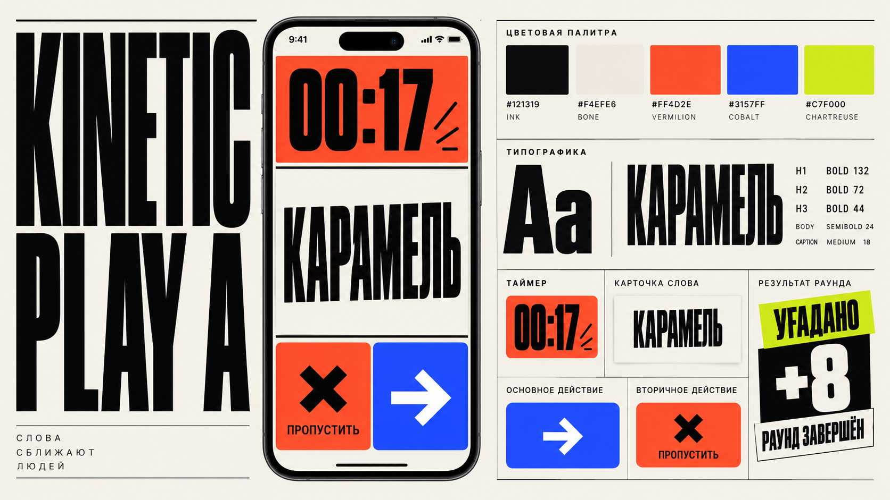
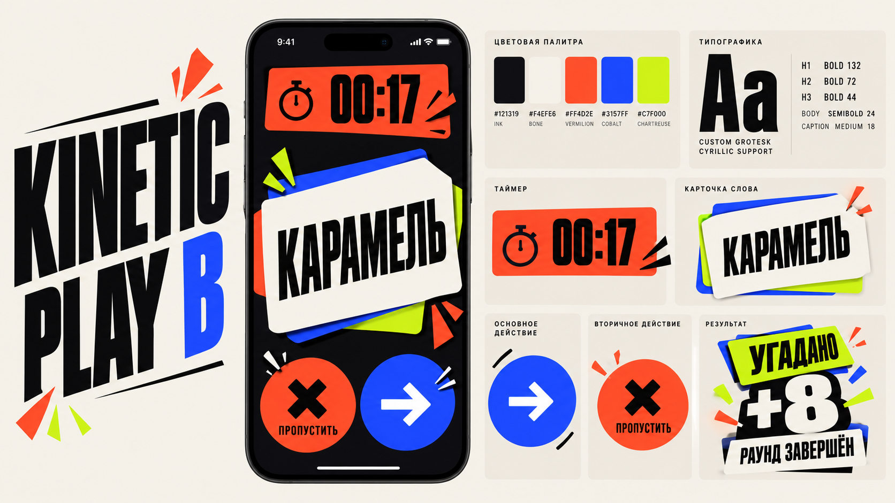
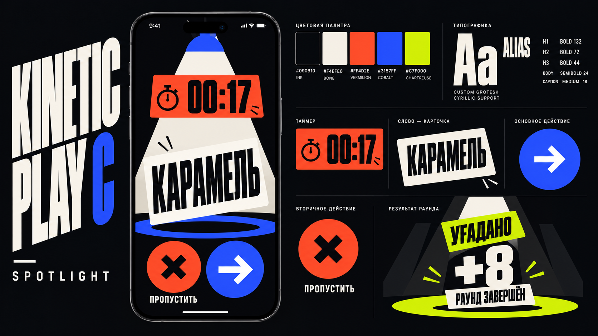

# Этап 1. Визуальная основа Kinetic Play

Статус: **Foundations v1 завершён; требуется проверка на новом пользовательском flow**.

## Цель

Перевести выбранное арт-направление из moodboard в точную систему правил, пригодную для проектирования экранов и реализации в SwiftUI.

## Задачи

### Цвет

- Определить базовый фон и цвет поверхности.
- Выбрать основной action-цвет.
- Разделить success, warning, danger и informational состояния.
- Определить цвета команд и правила их сочетания с системной палитрой.
- Проверить контраст текста и интерактивных элементов.
- Установить правило: сколько ярких цветов допустимо одновременно.

### Типографика

- Выбрать акцидентный шрифт с качественной кириллицей.
- Выбрать основной интерфейсный шрифт.
- Определить стили display, timer, score, screen title, section, body и caption.
- Проверить длинные русские слова и названия команд.
- Определить минимальные размеры и правила масштабирования.
- Проверить доступность и поведение Dynamic Type.

### Композиция

- Утвердить базовую spacing-сетку.
- Определить горизонтальные поля для компактных и крупных iPhone.
- Задать максимальную ширину контента.
- Установить правила асимметрии, наложения и декоративного кадрирования.
- Определить безопасные зоны для слова, таймера и основных действий.

### Формы и графика

- Определить радиусы и допустимые формы карточек.
- Выбрать один фирменный приём: срезанный угол, смещение слоя или графическая рамка.
- Создать небольшой словарь графических знаков движения.
- Установить правила использования SF Symbols.
- Определить допустимые тени, обводки и текстуры.

## Результаты этапа

- Style Tile Kinetic Play v1.
- Семантическая цветовая палитра.
- Типографическая шкала.
- Spacing и radius шкалы.
- Примеры основных поверхностей и кнопок.
- Набор разрешённых и запрещённых визуальных приёмов.
- Первичная таблица соответствия дизайн-токенов SwiftUI.

## Критерии готовности

- Все выбранные шрифты корректно отображают кириллицу.
- Цвета имеют однозначные продуктовые роли.
- Success и danger не могут быть перепутаны с primary action.
- Длинное слово сохраняет читаемость на компактном iPhone.
- Система выглядит узнаваемо без использования логотипа.
- Каждый эффект имеет реалистичный путь реализации в SwiftUI.

## Не входит в этап

- Полная библиотека компонентов.
- Все продуктовые экраны.
- Финальный логотип.
- Детальная motion-спецификация.

## Раунд исследования 1: внутренние вариации

Дата: 2026-10-03.

Для честного сравнения все три вариации используют одинаковую продуктовую основу:

- активный раунд;
- слово «КАРАМЕЛЬ»;
- таймер `00:17`;
- primary action «УГАДАНО»;
- secondary action «ПРОПУСТИТЬ»;
- результат `+8`;
- одну рабочую палитру Kinetic Play.

Сгенерированные style tile не являются финальными UI-макетами. Ошибки текста, случайные детали и пропорции в них не считаются дизайн-решениями.

### Вариация A: Broadcast Grid

Характер: строгая типографическая система в духе прямого игрового эфира.

Сильные стороны:

- самая ясная информационная иерархия;
- хорошо масштабируется на настройки, списки и результаты;
- минимальная зависимость от декоративных элементов;
- наиболее предсказуемая реализация в SwiftUI;
- высокая читаемость на компактном iPhone.

Слабые стороны:

- без motion может восприниматься слишком статичной;
- существует риск приблизиться к обычному editorial UI;
- физичность жеста выражена слабее, чем в других вариациях.

Принцип: энергия создаётся масштабом, сеткой и типографикой.

### Вариация B: Card Impact

Характер: физичные карточки, смещения, слои и ударные реакции.

Сильные стороны:

- наиболее узнаваемое выражение Kinetic Play;
- естественная связь визуального языка со свайпами;
- сильная эмоциональная реакция на результат;
- фирменная форма карточки может стать основой всей системы.

Слабые стороны:

- декоративные слои уменьшают полезную площадь слова;
- при неконтролируемом использовании быстро возникает визуальный шум;
- круглые действия и большое количество акцентных знаков могут придать интерфейсу детский характер;
- требует строгих ограничений на количество слоёв и углов.

Принцип: энергия создаётся физикой карточек и столкновением плоских форм.

### Вариация C: Spotlight

Характер: минимальная тёмная сцена с изолированным главным объектом.

Сильные стороны:

- сильная драматургия и концентрация внимания;
- таймер и слово хорошо отделены от вторичного интерфейса;
- выразительно работает для кульминаций и финального результата;
- тёмный фон позволяет экономно использовать сигнальные цвета.

Слабые стороны:

- метафора прожектора слишком буквальна;
- сложнее масштабируется на настройки и длинные списки;
- может приблизить продукт к телевизионной викторине;
- постоянный тёмный сценический режим способен утомлять;
- декоративный луч не несёт самостоятельной UX-функции.

Принцип: энергия создаётся контрастом, изоляцией и сценическим reveal.

## Сравнение вариаций

| Критерий | Broadcast Grid | Card Impact | Spotlight |
| --- | --- | --- | --- |
| Узнаваемость | Высокая | Очень высокая | Высокая |
| Читаемость | Очень высокая | Высокая | Очень высокая |
| Эмоциональная энергия | Средняя без motion | Очень высокая | Высокая |
| Масштабируемость на весь продукт | Очень высокая | Высокая при ограничениях | Средняя |
| Accessibility | Очень высокая | Высокая | Высокая |
| Стоимость SwiftUI | Низкая | Средняя | Средняя |
| Главный риск | Излишняя строгость | Визуальный шум | Буквальная театральность |

## Предварительный арт-директорский вывод

Вариация C не рекомендуется как основа всего продукта. Её сценическая метафора сильна для редких кульминаций, но слишком ограничивает повседневные экраны.

Основной выбор находится между A и B:

- A даёт устойчивую продуктовую систему;
- B даёт собственный характер и физичность.

Предварительная рекомендация — развивать **Card Impact с дисциплиной Broadcast Grid**: сохранить физичную карточку, плоские смещения и ударный результат, но строить layout на строгой сетке и ограничивать каждый экран одним физическим акцентом. Это остаётся единым Kinetic Play, а не смешением с другим арт-направлением.

Статус рекомендации: **подтверждено владельцем продукта 2026-10-03**.

## Принятое решение

Основой визуальной системы становится **Card Impact**.

Broadcast Grid остаётся внутренним контрольным принципом, а не отдельным стилем: он используется только для сохранения иерархии, сетки и читаемости. Spotlight не используется как основа системы.

Обязательные ограничения Card Impact:

- один главный физичный объект на экране;
- не более двух видимых смещённых слоёв под активной карточкой;
- декоративные impact marks появляются только как реакция на событие;
- поворот текста запрещён, поворот карточки допускается в небольшом диапазоне;
- активное слово всегда находится на чистой контрастной поверхности;
- круглая форма не становится универсальной формой всех действий;
- физичность создаётся плоскими формами и motion, а не 3D и реалистичными материалами.

## Первичная проверка цветового контраста

Проверена рабочая палитра moodboard:

| Пара | Контраст | Вывод |
| --- | ---: | --- |
| Ink / Bone | 16.18:1 | Подходит для любого текста |
| Ink / Vermilion | 5.61:1 | Подходит для обычного текста |
| Ink / Cobalt | 3.48:1 | Только крупный текст и графика |
| Ink / Chartreuse | 14.03:1 | Подходит для любого текста |
| Bone / Vermilion | 2.89:1 | Не использовать для текста |
| Bone / Cobalt | 4.66:1 | Подходит для обычного текста |
| Bone / Chartreuse | 1.15:1 | Не использовать для текста |

Предварительные правила:

- на cobalt использовать bone-текст;
- на vermilion использовать ink-текст;
- на chartreuse использовать ink-текст;
- bone и ink остаются основной высококонтрастной парой;
- цвет не является единственным способом различать success и skip.

## Задачи Foundations v1 — выполнено

Для утверждённой траектории Card Impact подготовлены:

1. Семантические цветовые роли.
2. Шрифтовая пара с полной кириллицей.
3. Типографическая шкала.
4. Spacing и layout grid.
5. Radius, border и flat-shadow правила.
6. Точная геометрия игровой карточки.
7. Словарь impact marks и ограничения их использования.
8. Style Tile Kinetic Play / Card Impact v1.

## Результат Foundations v1

Требуемые foundations зафиксированы в отдельном комплекте документов:

- [Foundations overview](Foundations/README.md)
- [Colors](Foundations/colors.md)
- [Typography](Foundations/typography.md)
- [Layout and Shape](Foundations/layout-and-shape.md)
- [Card Impact Language](Foundations/card-impact-language.md)
- [SwiftUI Token Map](Foundations/swiftui-token-map.md)

Визуальный style tile:

Этап 1 считается завершённым на уровне рабочей системы v1. Токены могут быть скорректированы только после проверки на новом пользовательском flow и компактном iPhone.
