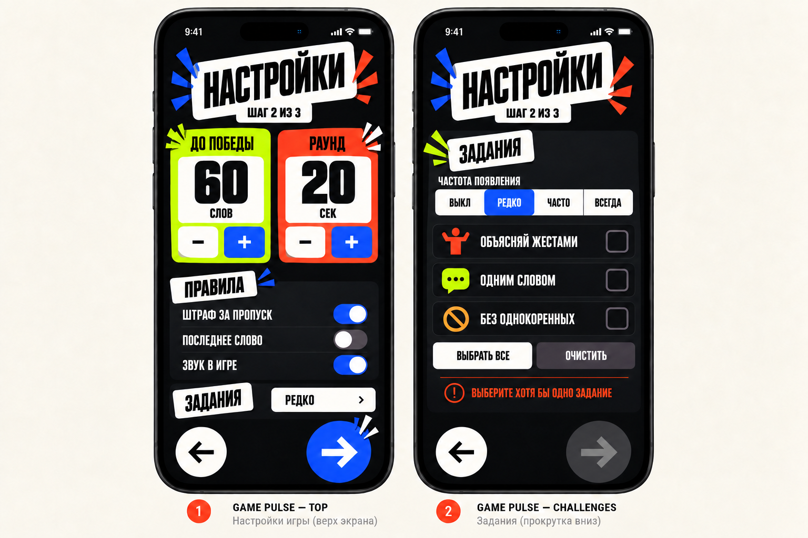
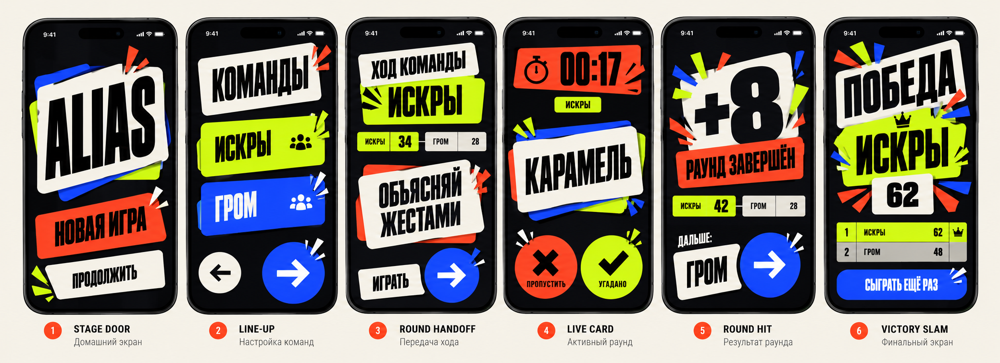

# Этап 2. Experience Architecture v1

## Решение

Alias строится не как набор независимых настроечных экранов, а как три последовательных режима опыта:

1. **Собрать игру** — короткий и спокойный setup.
2. **Передавать сцену** — физический момент между командами.
3. **Играть** — единый матчевый контейнер с резко меняющейся интенсивностью.

Целевая архитектура содержит **8 основных экранов** и набор overlays. Это не копия текущего приложения. Количество выбрано по самостоятельным задачам пользователя и сменам контекста.

## Capability map

### До игры

- начать новую игру;
- продолжить единственное корректное сохранение;
- показать недоступное продолжение, если сохранения нет или оно повреждено;
- подтвердить замену незавершённой игры;
- открыть правила без чтения или изменения сохранения;
- создать 2–5 различимых команд со стабильной идентичностью;
- настроить цель 20–200 с шагом 5;
- настроить раунд 10–120 секунд с шагом 5;
- настроить штраф за пропуск, общее последнее слово и звук;
- выбрать частоту и допустимые задания;
- не разрешить продолжение при активных заданиях без выбранного задания;
- восстановить последние подтверждённые настройки;
- выбрать одну из пяти категорий;
- не допустить старт с пустым набором слов.

### Перед раундом

- ясно назвать текущую команду;
- показать место команды в очереди и общий счёт;
- раскрыть назначенное задание и инструкцию;
- ждать явного действия «Играть»;
- создать или обновить контрольное сохранение.

### Во время раунда

- показать слово и обратный отсчёт;
- засчитать угаданное или пропущенное слово жестом и кнопкой;
- показать следующую непустую карточку;
- поставить игру на паузу вручную или при потере foreground;
- возобновить через `3 — 2 — 1 — Начали!` без уменьшения игрового таймера;
- завершить раунд автоматически при нуле;
- сохранять значимые действия и оставшееся время.

### Между раундами

- показать угаданные слова, пропуски, штрафы и итог раунда;
- прибавить итог только текущей команде;
- показать общий scoreboard;
- передать ход следующей команде по кругу;
- сохранить результат и корректно восстановить именно эту фазу.

### Завершение

- определить победу при достижении или превышении цели;
- показать все команды и их итоговые очки;
- удалить активное сохранение завершённой игры;
- вернуть пользователя в новый цикл без ложного `Continue Game`.

## Информационная архитектура

```text
HOME / STAGE DOOR
├── Continue ─────────────────────────────────────────────┐
├── New Game                                              │
│   └── 01 Teams ──▶ 02 Match Setup ──▶ 03 Category      │
│                                      └──▶ ROUND CALL ◀──┘
└── Rules sheet                              │
                                            ▼
                                      ACTIVE ROUND
                                       │    │
                                 Pause │    │ Timer 0
                                       ▼    ▼
                                  Pause overlay
                                            │
                                            ▼
                                      ROUND RESULT
                                       │          │
                                next team       victory
                                       │          │
                                       └─▶ CALL   ▼
                                               FINAL
```

## Восемь основных экранов

### 1. Stage Door — главный экран

**Цель:** за один взгляд выбрать продолжение или начало новой игры.

**Первый объект:** логотип/словесный знак Alias как короткий opening title.

**Главное действие:**

- если сохранения нет — `Новая игра`;
- если сохранение есть — `Продолжить`, с названием текущей команды и фазой;
- `Новая игра` при активном сохранении остаётся вторичной и вызывает подтверждение замены.

**Композиция:** крупное свободное поле, одна активная Card Impact card и нижняя action-зона. Rules и настройки не конкурируют с началом игры.

### 2. Line-up — команды, шаг 1/3

**Цель:** собрать 2–5 команд без ощущения формы регистрации.

**Первый объект:** живой вертикальный stack цветных team cards.

**Главное действие:** продолжить с допустимым составом.

**Композиция:** номера команд крупнее полей имени; добавление команды — последняя card-slot; удаление недоступно на минимуме. Длинное имя ужимается до двух строк, но не меняет высоту карточки скачком.

**Навигация:** утверждённая круглая пара `Back / Forward` из Card Impact.

### 3. Game Pulse — правила и темп, шаг 2/3

**Цель:** настроить длительность и характер матча без длинного списка системных полей.

**Первый объект:** два крупных числовых блока `До победы` и `Раунд`.

**Главное действие:** продолжить с валидной конфигурацией.

**Композиция:**

- hero-row из двух value cards;
- блок `Правила` с тремя switches;
- блок `Задания` с частотой;
- список заданий раскрывается внутри той же секции только при активной частоте;
- validation появляется рядом с заданиями, а не общим alert.

Экран допускает вертикальный scroll. Нижняя пара `Back / Forward` закреплена над safe area и отделена от контента.



**Управление значениями:**

- `До победы`: 20...200 слов, шаг 5, default 60;
- `Раунд`: 10...120 секунд, шаг 5, default 20;
- используются явные `− / +`, а не slider: дискретные значения должны меняться точно;
- короткий tap меняет значение на один шаг, удержание повторяет изменение;
- на минимуме и максимуме соответствующая кнопка становится disabled;
- VoiceOver объявляет название параметра, текущее значение и границы;
- изменение значения не вызывает impact mark на каждом tap, чтобы настройка не выглядела как игровой раунд.

**Scroll и validation:**

- value cards и Rules находятся в верхней части;
- блок заданий раскрывается ниже и может прокручиваться под закреплённой нижней action-зоной;
- если частота не `Выключено`, но задания не выбраны, появляется inline error;
- в этом состоянии `Forward` становится серой, теряет тень и не реагирует на tap;
- `Back` остаётся доступной и сохраняет введённые значения.

### 4. Word Deck — категория, шаг 3/3

**Цель:** выбрать эмоциональный характер набора слов и закончить setup.

**Первый объект:** выбранная большая category card; остальные категории образуют компактную колоду.

**Главное действие:** запустить матч с выбранной категорией.

**Композиция:** пять карточек с названием, коротким пояснением и индикатором сложности. Выбор не зависит только от цвета. `Forward` недоступна до выбора.

При подтверждении создаётся активное сохранение и открывается подготовка первой команды.

### 5. Round Call — передача сцены

**Цель:** физически передать iPhone нужной команде и подготовить её к раунду.

**Первый объект:** название текущей команды на большой team-colored field.

**Главное действие:** `Играть`.

**Иерархия:** команда → задание → положение и счёт → запуск.

**Композиция:** scoreboard — узкая полоса, а не таблица; задание становится отдельной impact card только когда назначено. Крупная синяя круглая стрелка использует характер `Forward`, но рядом всегда есть текст `ИГРАТЬ`.

Возврат назад здесь не используется: выход в меню — отдельное явное действие с сохранением.

### 6. Live Card — активный раунд

**Цель:** читать слово и фиксировать исход максимально быстро.

**Первый объект:** слово на signature card.

**Главное действие:** свайп карточки; кнопки остаются равноценной доступной альтернативой.

**Иерархия:** слово → время → feedback действия → команда → пауза.

**Композиция:** один доминирующий card stack, таймер отдельным верхним signal field, действия в нижней зоне. Экран не показывает полный scoreboard и настройки.

Pause и resume countdown являются overlays этого экрана, а не новыми маршрутами.

### 7. Round Hit — результат раунда

**Цель:** быстро понять вклад команды и передать игру дальше.

**Первый объект:** крупный итог `+N`.

**Главное действие:** перейти к следующей команде.

**Иерархия:** итог → состав результата → общий счёт → список слов → следующий раунд.

**Композиция:** hero result card занимает верхнюю треть; угаданные и пропущенные слова доступны ниже без сокрытия самого итога. Следующая команда названа рядом с круглым `Forward`.

### 8. Victory Slam — финал

**Цель:** эмоционально объявить победителя и завершить матч.

**Первый объект:** команда-победитель и её счёт.

**Главное действие:** новая игра. Возврат в меню — вторичное.

**Композиция:** единственное место, где разрешён многоцветный burst. Полный scoreboard остаётся читаемым и не прячется за декором.

## Overlays и sheets

Они не считаются отдельными основными экранами:

- `Replace Saved Game` — подтверждение удаления активного сохранения;
- `Rules` — reference sheet из Home и Pause;
- `Pause` — замораживает текущую карточку и таймер;
- `Resume Countdown` — `3`, `2`, `1`, `Начали!`;
- `Leave to Menu` — объясняет, что игра будет сохранена;
- inline validation заданий;
- invalid-save notice на Home без отдельного тупикового error screen.

## Навигационная модель

### Setup

Setup становится обратимым: `Back` возвращает на предыдущий шаг, не сбрасывая введённые данные. Это принятое продуктовое решение и не ограничивается текущей реализацией навигации.

### Match

Фазы матча живут в одном контейнере и не используют свободную back-навигацию:

- `Round Call → Live Card → Round Hit → Round Call`;
- при победе `Round Hit → Victory Slam`;
- выход из матча всегда проходит через действие `Меню` и сохранение;
- восстановление открывает сохранённую фазу, а активный раунд — только в Pause.

## Состояния и edge cases

| Ситуация | Решение интерфейса |
| --- | --- |
| Нет сохранения | Continue видима, но disabled; New Game доминирует |
| Повреждённое сохранение | Continue disabled, короткое объяснение без блокирующего экрана |
| Новая игра поверх сохранения | Destructive confirmation sheet |
| Две команды | Remove скрыт или disabled без изменения layout |
| Пять команд | Add slot заменяется status `Максимум 5` |
| Задания включены, но ничего не выбрано | Inline error + disabled Forward |
| Длинное название команды | До двух строк, Dynamic Type, без горизонтального marquee |
| Категория не выбрана | Forward disabled |
| Пустой word pool | Раунд не стартует; recoverable error до таймера |
| Пул исчерпан в игре | Следующее слово подаётся без отдельного UI-состояния |
| Приложение вернулось из background | Pause overlay, только явное Resume |
| Победа | Переход сразу в Victory Slam, без кнопки следующего раунда |

## Проверка Foundations v1

### Что выдержало проверку

- Ink/Bone создают спокойный setup и контрастную арену без второй темы.
- Cobalt подходит для движения вперёд и запуска.
- Chartreuse и Vermilion остаются чистыми игровыми сигналами success/skip.
- Signature card масштабируется от category selection до active word и result hero.
- Flat shadows поддерживают физичность во всех режимах.
- Sofia Sans Extra Condensed работает для коротких названий, счёта и кульминаций; SF Pro остаётся основой настроек.

### Корректировки

- Круглая геометрия официально закреплена как исключение для `Back / Forward` и icon-only controls.
- Setup использует impact marks только на подтверждении шага, а не как постоянный декор.
- Team colors появляются крупно только на `Line-up` и `Round Call`; во время активного раунда они сведены к небольшому идентификатору.
- На светлых setup-экранах flat shadow остаётся чёрной; на Ink-арене используется цветная offset-подложка.

## Продуктовые расхождения, которые нельзя замаскировать дизайном

- `Общее последнее слово` сохраняется, но пока не имеет игрового поведения. До исправления настройку нельзя визуально обещать как работающую функцию.
- Звук сохраняется, но пока не управляет всей обратной связью.
- Часть категорий и исчерпание word pool имеют известные проблемы реализации.
- Добавление команды может создать повторяющееся имя.

Эти пункты должны быть решены во время внедрения обновлённого flow.

## Вердикт этапа

Card Impact выдерживает весь вертикальный срез. Направление не должно ограничиваться экраном карточки: его характер лучше всего раскрывается в контрасте спокойного setup, физичной передачи сцены, концентрированного live-раунда и ударного финала.

## Визуальный storyboard



Storyboard проверяет шесть ключевых моментов: Stage Door, Line-up, Round Call, Live Card, Round Hit и Victory Slam. Это арт-директорская проверка композиции и интенсивности, а не pixel-perfect handoff. Случайные особенности сгенерированной типографики или локальные размеры не являются утверждёнными UI-решениями.

Game Pulse вынесен в отдельную подробную визуализацию выше, потому что основной storyboard проверяет эмоциональную дугу, а не каждый setup-шаг.

Проверка показала:

- круглая пара `Back / Forward` органично принадлежит Line-up и другим setup-шагам;
- `Forward` может стать повторяющимся визуальным якорем запуска и передачи хода;
- активный раунд должен оставаться самым чистым экраном, несмотря на высокую интенсивность;
- Round Hit визуально отделяется от Victory Slam количеством цвета и декора;
- chartreuse на team field требует аккуратного использования, чтобы не смешиваться с success — в финальных макетах команда всегда дополнительно идентифицируется названием и паттерном.

Следующий этап — детально спроектировать `Live Card` и все его состояния без повторного изменения общей архитектуры.
