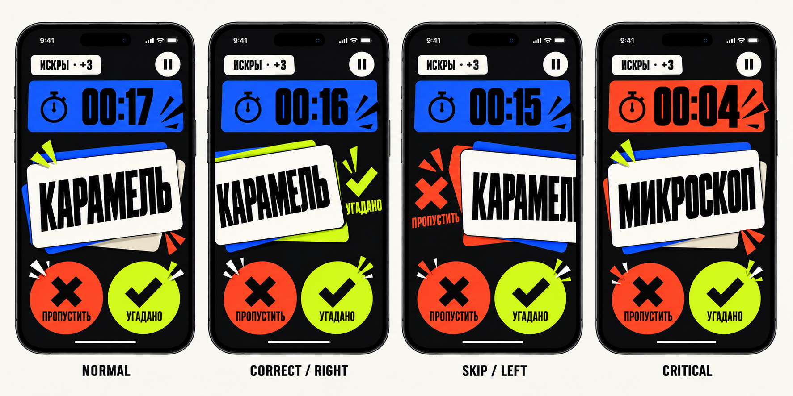
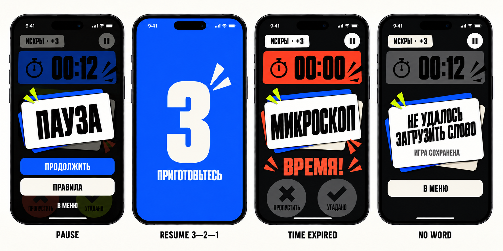

# Этап 3. Live Card v1

## Решение

`Live Card` — самый быстрый и самый чистый экран Alias. Во время раунда приложение не показывает полный scoreboard, настройки или длинные инструкции. На экране остаются только элементы, необходимые для следующего решения игрока:

1. текущее слово;
2. оставшееся время;
3. две альтернативы исхода;
4. текущая команда и счёт этого раунда;
5. пауза.

Главный принцип: **одно слово — одно движение — немедленный следующий card**.

## Анатомия экрана

```text
┌──────────────────────────────────────┐
│ [ИСКРЫ · +3]                 [pause] │
│                                      │
│ ┌──────────────────────────────────┐ │
│ │              00:17               │ │
│ └──────────────────────────────────┘ │
│                                      │
│      offset layer / next signal      │
│   ┌──────────────────────────────┐   │
│   │                              │   │
│   │          КАРАМЕЛЬ            │   │
│   │                              │   │
│   └──────────────────────────────┘   │
│                                      │
│    [ × ПРОПУСТИТЬ ] [ ✓ УГАДАНО ]    │
└──────────────────────────────────────┘
```

### Иерархия

1. Word card.
2. Timer field.
3. Результат текущего жеста.
4. Outcome controls.
5. Team context.
6. Pause.

## Layout

### Общая структура

- Background: `ink900`.
- Контент следует safe area.
- Экран не скроллится.
- Верхний context row и нижняя action-зона имеют стабильную высоту.
- Word card центрируется в оставшемся пространстве, а не по геометрическому центру всего экрана.
- Только word card может выходить за строгую сетку во время drag.

### Размеры

| Элемент | Compact ≤375 pt | Standard 390–428 pt | Large ≥430 pt |
| --- | ---: | ---: | ---: |
| Horizontal inset | 20 | 24 | 32 |
| Context row | 44 | 44 | 48 |
| Timer height | 56 | 64 | 64 |
| Timer gap after context | 8 | 12 | 12 |
| Word card height | 184–204 | 208–228 | 224–240 |
| Word card max width | container | container | 390 |
| Outcome circle | 76 | 84 | 88 |
| Action gap | 24 | 32 | 40 |
| Bottom safe-area gap | 12 | 16 | 20 |

Если вертикального пространства мало, сокращаются gaps и высота word card до 184 pt. Timer, touch targets и полное слово не уменьшаются первыми.

## Context row

### Team badge

- Показывает `Название команды · +N`.
- `+N` — текущий результат раунда, не общий командный счёт.
- Высота 36 pt, `radiusSmall`, bone surface.
- Team color используется как 6 pt leading bar и паттерн, а не как полный background активного экрана.
- Название ограничено одной строкой визуально, но полное значение доступно VoiceOver.

### Pause

- 44 × 44 pt icon-only circle.
- Bone fill, Ink symbol.
- Accessibility label: `Поставить раунд на паузу`.
- Не окрашивается в cobalt: это системное, а не направляющее действие.

## Timer field

Timer — прямоугольный signal field со срезом верхнего правого угла 14 pt. Он занимает ширину контейнера, но визуально остаётся вторым объектом после слова.

| Состояние | Условие | Fill | Поведение |
| --- | --- | --- | --- |
| Normal | больше 10 сек | `actionPrimary` | Стабильный, без постоянной анимации |
| Warning | 10...6 сек | `feedbackWarning` | Один `snap` при входе в состояние |
| Critical | 5...1 сек | `feedbackDanger` | Цифры увеличиваются на 4 pt, короткий tick motion |
| Expired | 0 сек | `feedbackDanger` | `00:00`, input lock, переход к result |
| Paused | фаза pause | `surfaceMuted` | Иконка pause и подпись `ПАУЗА` |

- Формат: `MM:SS`.
- Цифры: tabular, condensed, Black.
- Normal size: 48 pt compact, 56 pt standard.
- Critical size: 52 pt compact, 60 pt standard.
- Цвет не является единственным сигналом: меняются impact mark, подпись и scale цифр.
- Сильный haptic не повторяется каждую секунду.

## Signature word card

- Face: `bone50`, 2 pt Ink border, radius 24, top-right cut 18.
- Aspect target: 16:10.
- Две offset layers: cobalt и нейтральная bone/ink layer.
- Idle rotation: от −1° до +1°, стабильная для текущей карточки, не случайно меняющаяся каждый frame.
- Word: uppercase, Sofia Sans Extra Condensed Black, 64 pt standard.
- Максимум две строки; minimum scale 40 pt.
- Длинные слова сначала переносятся, затем уменьшаются.
- Никакой деформации ширины glyph.
- Card не показывает категорию, счёт или инструкцию задания.

## Outcome controls

Активный раунд вводит второе осознанное исключение для круглой геометрии: два равноценных игровых исхода.

### Skip

- 76/84/88 pt circle по размерному классу.
- Fill: `feedbackDanger`.
- Ink xmark + короткая подпись `ПРОПУСТИТЬ`.
- Расположена слева и соответствует свайпу влево.

### Correct

- Тот же размер, что Skip.
- Fill: `feedbackSuccess`.
- Ink checkmark + подпись `УГАДАНО`.
- Расположена справа и соответствует свайпу вправо.

### Общие правила

- Кнопки равны по размеру: интерфейс не оценивает один исход как «правильный UI-выбор».
- Под ярким face используется bone offset layer 4 pt, заметный на Ink background.
- Pressed: face смещается вниз на 4 pt, offset сокращается до 1 pt.
- Tap запускает ту же анимацию и тот же intent, что соответствующий swipe.
- После подтверждения input блокируется до появления следующей карточки.
- При Accessibility text sizes круги заменяются текстовыми action cards высотой 56 pt; semantics не меняется.

## Gesture model

### Направления

- Swipe left — `Skip`.
- Swipe right — `Correct`.
- Вертикальный gesture не засчитывает слово.

### Пороги

Все дистанции рассчитываются от доступной ширины word card `W`.

| Фаза | Условие | UI feedback |
| --- | --- | --- |
| Touch | `< 12 pt` | Card остаётся визуально idle |
| Preview | `≥ 0.12W` | Проявляется semantic underlay и symbol |
| Armed | `≥ 0.30W` | Medium haptic один раз, label становится полностью видимым |
| Commit | release при `≥ 0.34W` | Исход фиксируется |
| Fast commit | predicted end `≥ 0.48W` и velocity `≥ 650 pt/s` | Исход фиксируется даже при более коротком release offset |
| Cancel | release ниже commit | Card возвращается, счёт не меняется |

Дополнительные ограничения:

- horizontal intent начинается, когда `abs(dx) > abs(dy) × 1.2`;
- vertical offset визуально clamp до 24 pt;
- rotation вычисляется от `dx / W`, максимум ±5°;
- после Armed haptic не повторяется при дрожании около порога;
- противоположный outcome не может быть вызван тем же gesture после commit;
- multi-touch и повторный tap во время transition игнорируются.

Порог является рабочей спецификацией v1 и должен быть проверен на физическом iPhone до реализации как окончательная константа.

## Card transitions

### Correct

1. Ближайшая underlay становится chartreuse.
2. Справа появляется checkmark и `УГАДАНО`.
3. После commit card уходит вправо за 180–220 ms.
4. Следующая card появляется из небольшого offset снизу за 160–200 ms.
5. Team badge обновляет `+N` после ухода старой карточки, а не до него.

### Skip

1. Ближайшая underlay становится vermilion.
2. Слева появляется xmark и `ПРОПУСТИТЬ`.
3. После commit card уходит влево с тем же timing.
4. Следующая card появляется тем же способом.
5. При включённом штрафе визуально не показывается отрицательный total до Round Hit; team badge показывает текущий рассчитанный результат, ограниченный снизу нулём.

### Cancelled drag

- Underlay возвращается в idle-color.
- Card возвращается spring animation 260–340 ms.
- Нет sound и score haptic.
- Возврат не выглядит как error: это нормальная отмена незавершённого жеста.

## State map

```text
            ┌──────────────┐
            │    Normal    │
            └──────┬───────┘
          time 10  │  drag/tap
                   │
       ┌───────────▼───────────┐
       │ Warning / Critical    │
       └───────┬───────────────┘
               │
       ┌───────┼───────────────┐
       │       │               │
 correct/skip pause          time 0
       │       │               │
       ▼       ▼               ▼
 next card   Pause        Round Result
               │
             Resume
               │
               ▼
        3 → 2 → 1 → НАЧАЛИ!
               │
               └──────────▶ Normal / timed state
```

## Visual state boards

### Core interaction states



Показаны Normal, Correct/Right, Skip/Left и Critical. В idle-состояниях semantic success/danger colors отсутствуют в подложках word card; они появляются только после соответствующего жеста или в critical timer.

### System states



Показаны Pause, Resume countdown, Time Expired и defensive No Word. Это state reference, а не покадровый motion storyboard; длительности и easing уточняются на этапе 4.

## Pause

- Active content остаётся на месте, но закрывается Ink overlay с opacity 88%; blur не используется.
- Центральная bone card показывает `ПАУЗА`, оставшееся время и текущую команду.
- Primary: `ПРОДОЛЖИТЬ`.
- Secondary: `ПРАВИЛА`.
- Destructive/exit: `В МЕНЮ` с объяснением, что игра будет сохранена.
- Word outcome actions скрыты или disabled и не доступны VoiceOver.
- При автоматической паузе после background добавляется подпись `ИГРА ПРИОСТАНОВЛЕНА`.

## Resume countdown

- Последовательность обязательна: `3`, `2`, `1`, `НАЧАЛИ!`.
- `3`, `2`, `1`: по 650 ms.
- `НАЧАЛИ!`: 400 ms.
- Игровой timer не уменьшается во время countdown.
- Каждый шаг заменяет предыдущий на одном full-screen field; одновременно виден только один glyph.
- Используется cobalt/bone alternating field, без конфетти.
- Если приложение теряет foreground, countdown отменяется и возвращается Pause.
- Повторный tap Resume игнорируется.

## Expiration

Когда timer достигает нуля:

1. Gesture и outcome buttons блокируются немедленно.
2. Текущая карточка не засчитывается и не требует решения.
3. Timer показывает `00:00` и делает один короткий `snap`.
4. Через 240–320 ms экран переходит в `Round Hit`.
5. Переход не ждёт завершения длинной декоративной анимации.

Если commit слова и timer zero приходят практически одновременно, результат определяет игровая state machine. UI не пытается самостоятельно разрешить race condition.

## Defensive no-word state

По продуктовому контракту active round никогда не должен отображать пустую карточку. Если runtime всё же не получает следующее слово:

- timer немедленно останавливается;
- пустая Signature Card не показывается;
- появляется blocking bone card `НЕ УДАЛОСЬ ЗАГРУЗИТЬ СЛОВО`;
- доступно безопасное действие `В МЕНЮ`, сохраняющее игру;
- нормальный раунд не продолжается до получения валидного слова.

Это защитное состояние не заменяет исправление пустых категорий и исчерпания word pool. Политика автоматического retry или перестройки word pool требует отдельного продуктового решения.

## Motion, sound, haptics

| Event | Motion | Haptic | Sound |
| --- | --- | --- | --- |
| Preview threshold | Underlay reveal | none | none |
| Armed threshold | Symbol locks | medium once | none |
| Correct commit | Exit right + snap mark | success | short positive cue if enabled |
| Skip commit | Exit left + speed mark | light | neutral cue if enabled |
| Warning entry | Timer snap | light | none |
| Critical tick | 2 pt scale/vertical tick | none | optional soft tick if enabled |
| Time expired | Timer impact | warning | round-end cue if enabled |
| Pause | Overlay settle | light | none |

Звуковая настройка управляет всеми игровыми sound cues. Haptic не используется как единственный feedback и следует системным accessibility-настройкам.

## Accessibility

### VoiceOver order

1. Текущее слово.
2. Оставшееся время.
3. Текущий результат раунда и команда.
4. `Пропустить`.
5. `Угадано`.
6. `Пауза`.

### Gesture independence

- Любое слово можно разрешить без swipe.
- Кнопки доступны при VoiceOver и Switch Control.
- Custom actions `Угадано` и `Пропустить` могут быть добавлены к word card, но не заменяют видимые controls.

### Dynamic Type

- Interface labels поддерживают Dynamic Type.
- Game word и timer масштабируются в заданных пределах, чтобы не разрушать композицию.
- При accessibility-размерах outcome controls становятся прямоугольными action cards с полным текстом.
- Вторичный team badge может перейти на две строки, context row увеличивается до 64 pt.

### Reduce Motion

- Card exit заменяется fade + 12 pt translation.
- Cancelled drag возвращается ease-out без spring overshoot.
- Timer не пульсирует; warning/critical различаются цветом, подписью и symbol.
- Resume countdown использует dissolve вместо zoom.
- Время доступа к следующему действию не увеличивается.

## SwiftUI implementation notes

Это не кодовый контракт, а границы ответственности для будущей реализации.

- ViewModel владеет фазой, timer, текущим словом, score и разрешением outcome.
- View владеет transient drag offset, rotation, preview progress и локальным impact mark.
- Единственный метод intent принимает `correct` или `skip`; swipe и button вызывают один путь.
- ViewModel отклоняет outcome вне active phase и повторный outcome во время перехода.
- Resume countdown является отдельным presentation substate, но не запускает второй игровой timer.
- Remaining time сохраняется не реже раза в секунду.
- SwiftUI `DragGesture`, custom `Shape`, `sensoryFeedback` и standard animation APIs достаточны; сторонний gesture engine не нужен.
- Reduce Motion читается из environment и меняет presentation, а не правила игры.

## Acceptance checklist

- Слово считывается первым на компактном и крупном iPhone.
- Normal timer не конкурирует со словом.
- Warning и Critical различимы без опоры только на цвет.
- Левый и правый outcome невозможно перепутать по symbol, position и motion.
- Короткий случайный drag не засчитывается.
- Swipe и button дают одинаковый игровой результат.
- После commit невозможно двойное начисление.
- При zero текущая карточка не требует решения.
- Pause и восстановление никогда не запускают timer автоматически.
- Active round полностью проходим без gesture.
- Reduce Motion сохраняет все состояния.
- Пустое слово никогда не отображается как обычная карточка.
