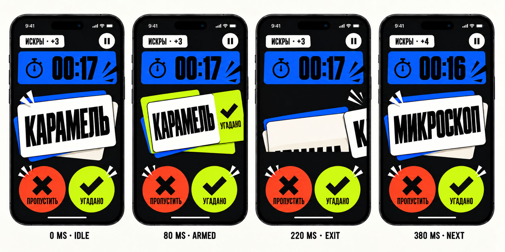
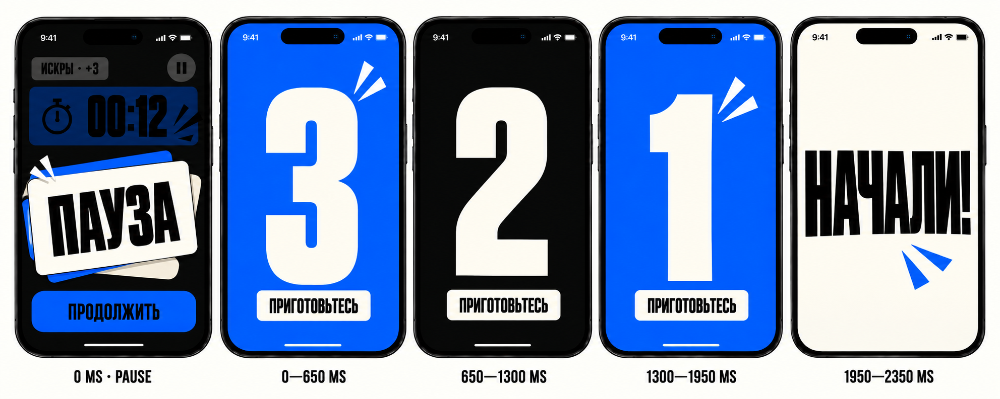

# Этап 4. Motion Language v1

## Решение

Motion Alias строится на контрасте: setup двигается спокойно и направленно, активный раунд отвечает быстро и физично, результат даёт короткий удар, а финальная победа получает единственную длинную кульминацию.

Motion не управляет правилами игры. Game state, timer, score и persistence обновляются независимо от animation completion.

Базовые tokens находятся в [Foundations/motion.md](Foundations/motion.md).

## 1. Button physics

### Press

```text
0 ms       touch down
0–80 ms    face: y +4 pt, scale 0.985
            flat shadow: 5 pt → 1 pt
80–120 ms  hold/settle
release     semantic action + return or transition
```

- Fill не затемняется.
- Icon и label двигаются вместе с face.
- Haptic происходит на semantic event, а не на каждый визуальный press.
- Long-press repeat для settings stepper использует системный cadence; impact mark не повторяется.

### Back / Forward

- Back: light haptic, контент уходит вправо.
- Forward: medium haptic после успешной validation, короткий speed mark справа.
- Navigation controls остаются закреплёнными, пока меняется содержимое шага.
- Disabled Forward не двигается и не создаёт haptic.

## 2. Setup navigation

### Forward

```text
0–120 ms    Forward button press
80–220 ms   current content: x 0 → -20, opacity 1 → 0
140–420 ms  next content: x +20 → 0, opacity 0 → 1
```

Total perceived transition: 280 ms после release. Заголовок шага и контент движутся, нижняя action-зона остаётся стабильной.

### Back

Та же схема в обратном направлении. Back не получает impact mark: движение назад намеренно тише.

### Validation

- Невалидное поле делает один 2 pt horizontal nudge за 160 ms.
- Error text появляется fade + 8 pt vertical translation за 200 ms.
- Экран целиком не трясётся.
- После исправления error исчезает за 120 ms.

## 3. Round Call → Live Card

Переход должен ощущаться как выход команды на сцену, но не съедать игровое время.

```text
0 ms        tap «Играть», intent принят
0–120 ms    Forward/Play press
80–220 ms   team field и challenge card уходят вверх на 20 pt
120–340 ms  Live Card появляется снизу на 20 pt + fade
340 ms      Live Card интерактивен; timer и active phase стартуют вместе
```

Timer не запускается под закрывающей его transition. Повторный tap во время перехода игнорируется.

## 4. Word resolution choreography

### Commit point

В момент commit одновременно происходят:

- outcome передаётся ViewModel;
- score и persistence обновляются;
- input блокируется;
- срабатывают semantic haptic и sound;
- View сохраняет snapshot уходящей карточки для motion.

### Correct

```text
0 ms        release / button intent
0–80 ms     checkmark locks, chartreuse underlay fully reveals
0–220 ms    outgoing snapshot exits right with easeExit
200–360 ms  next card enters from y +12 with springEnter
360–380 ms  score badge settles; input unlock
```

### Skip

Тот же timing зеркально влево. Используется vermilion underlay, xmark и более мягкий haptic.

### Cancelled drag

```text
0 ms        release below commit threshold
0–300 ms    card returns with springReturn
0–160 ms    semantic preview fades out
300 ms      input remains active throughout return where safe
```

Cancel не создаёт sound, score feedback или error styling.

### Throughput rule

Следующее слово должно быть полностью читаемо не позже 380 ms после commit. Декоративный impact mark может завершиться позже, но не блокирует input.

## 5. Timer choreography

### Normal tick

- Цифры обновляются с `motionInstant` crossfade.
- Timer field не пульсирует каждую секунду.
- Tabular digits исключают horizontal jump.

### Enter Warning at 10

```text
0–160 ms    cobalt → amber
40–200 ms   один amber snap mark
0 ms        один light haptic
```

### Enter Critical at 5

```text
0–160 ms    amber → vermilion
0–200 ms    digits scale 1.00 → 1.04 → 1.00
0 ms        один medium haptic
```

На секундах `4...1` допускается только 2 pt vertical tick цифр. Повторяющийся haptic запрещён. Sound tick, если включён, остаётся коротким и тихим.

### Zero

```text
0 ms        timer stops, input lock, 00:00
0–200 ms    one snap impact + warning haptic
200–480 ms  Live Card content exits
280–520 ms  Round Hit hero result enters
```

Текущее слово не получает outcome animation.

## 6. Pause

### Manual pause

Game timer останавливается синхронно с intent, до начала анимации.

```text
0–180 ms    solid Ink scrim: opacity 0 → 0.88
60–300 ms   Pause card: y +12 → 0, scale 0.98 → 1.00
120–280 ms  actions stagger 40 ms each
```

Blur не используется. Active controls сразу исключаются из accessibility tree.

### Automatic pause

При потере foreground timer и game state останавливаются немедленно. При возвращении Pause отображается уже в конечном состоянии, без hero entrance animation.

## 7. Resume countdown

Полная длительность: **2350 ms**.

| Segment | Duration | Motion |
| --- | ---: | --- |
| `3` | 650 ms | 100 ms enter, 370 ms hold, 180 ms exit |
| `2` | 650 ms | то же |
| `1` | 650 ms | то же |
| `НАЧАЛИ!` | 400 ms | 120 ms impact, 180 ms hold, 100 ms dissolve |

- Each numeral uses scale 0.86 → 1.00 → 1.04 and opacity 0 → 1 → 0.
- Background alternates cobalt and Ink, one field at a time.
- Timer remains frozen for all 2350 ms.
- Timer resumes only after `НАЧАЛИ!` leaves.
- Repeated Resume does nothing.
- Foreground loss cancels the sequence and returns to Pause.

Reduce Motion: fixed-scale numerals with 120 ms dissolve in/out; segment duration and game timing remain identical.

## 8. Round Hit

```text
0–180 ms    result card enters from y +16, opacity 0 → 1
80–360 ms   +N scales 0.86 → 1.06 → 1.00 with springImpact
220–520 ms  score breakdown and scoreboard rows appear
360–520 ms  next-team action becomes interactive
```

- Score counting animation lasts максимум 320 ms and does not hide final value.
- Words list appears without stagger if it is already on screen.
- Only one semantic color dominates the reveal.

## 9. Victory Slam

Total hero choreography: **720 ms**.

1. Winner field enters — 0...240 ms.
2. Score hits — 120...420 ms.
3. Controlled multicolor burst — 260...620 ms.
4. Final scoreboard settles — 400...720 ms.

Primary action becomes available by 720 ms. Confetti loop, particle rain and perpetual celebration are forbidden.

## 10. Haptic matrix

| Event | Feedback | Frequency |
| --- | --- | --- |
| Back | light impact | once |
| Valid Forward | medium impact | once |
| Stepper value | selection | first tap and bounds, not every accelerated repeat |
| Card Armed | selection | once per drag |
| Correct commit | success | once |
| Skip commit | light impact | once |
| Warning entry | light impact | at 10 only |
| Critical entry | medium impact | at 5 only |
| Timer zero | warning | once |
| Pause | light impact | once |
| Resume `НАЧАЛИ!` | medium impact | once |
| Round result | medium impact | once |
| Victory | success then medium impact | максимум two events |

Haptic не зависит от настройки `Звук в игре`, но уважает системные настройки устройства.

## 11. Sound matrix

| Event | Character | Max duration |
| --- | --- | ---: |
| Correct | short bright click | 100 ms |
| Skip | muted low click | 80 ms |
| Critical ticks | soft dry tick | 60 ms |
| Timer zero | distinct end cue | 220 ms |
| Countdown numerals | short neutral tick | 70 ms |
| `НАЧАЛИ!` | compact start cue | 160 ms |
| Victory | short two-part sting | 500 ms |

- `Звук в игре = off` отключает все cues из таблицы.
- Sound не запускается для обычной navigation и settings controls.
- Sound никогда не задерживает state transition.
- Текущее поведение приложения не выполняет это последовательно; sound routing должен быть исправлен при внедрении.

## 12. Reduce Motion matrix

| Default | Reduce Motion |
| --- | --- |
| Card exit за границу + rotation | Fade + 12 pt translation, no rotation |
| Spring return | Ease-out return, no overshoot |
| Setup directional slide 20 pt | Crossfade + 8 pt shift |
| Timer scale tick | Label/symbol change without scale |
| Pause card spring | Fade + 8 pt rise |
| Countdown scale | Dissolve at fixed scale |
| Round result slam | Fade + 8 pt rise |
| Victory burst expansion | Sequential static marks + fade |

Reduce Motion не меняет durations resume countdown или момент возобновления timer.

## 13. SwiftUI handoff

- Motion tokens оформляются в `CardImpactMotion`.
- `Transaction` выбирает default или reduced preset по `accessibilityReduceMotion`.
- Drag следует пальцу без implicit animation; animation применяется только после release.
- Outgoing card snapshot отделён от нового `currentWord`, чтобы persistence не ждала visual exit.
- `KeyframeAnimator` подходит для countdown и result impact на iOS 17.5.
- `PhaseAnimator` допустим для короткого impact mark, но не для бесконечных loops.
- `sensoryFeedback` получает semantic trigger, а не значение drag offset.
- Timer cadence приходит от game clock; animation не является источником времени.
- Scene phase cancellation должна останавливать countdown task и transient animations.
- Все animations локальны компоненту; глобальный `.animation(_:value:)` на корневом game view запрещён.

## Visual storyboards

### Card resolution — 380 ms



Storyboard показывает четыре обязательные точки: Idle, Armed, Exit и готовую следующую карточку. Это не четыре UI-состояния, а snapshot одной 380 ms последовательности.

### Resume countdown — 2350 ms



Countdown намеренно занимает весь экран: активное слово и timer скрыты, чтобы игрок не начал объяснение раньше `НАЧАЛИ!`.

## Acceptance checklist

- Card cycle не превышает 380 ms.
- Timer не теряет секунды из-за navigation или card animation.
- Первое слово не скрыто transition после фактического старта timer.
- Двойной tap не создаёт двойной outcome.
- Pause останавливает game time до появления overlay.
- Resume длится 2350 ms и не уменьшает timer.
- Background interruption отменяет resume countdown.
- Warning и Critical не создают повторяющийся сильный haptic.
- Sound Off выключает каждый игровой cue.
- Reduce Motion сохраняет смысл и timing состояний.
- Victory заметно сильнее Round Hit, но заканчивается за 720 ms.
