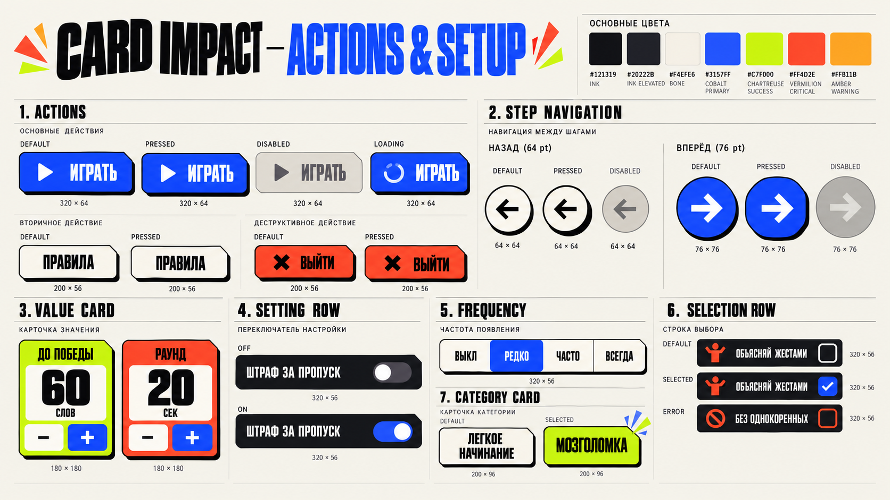
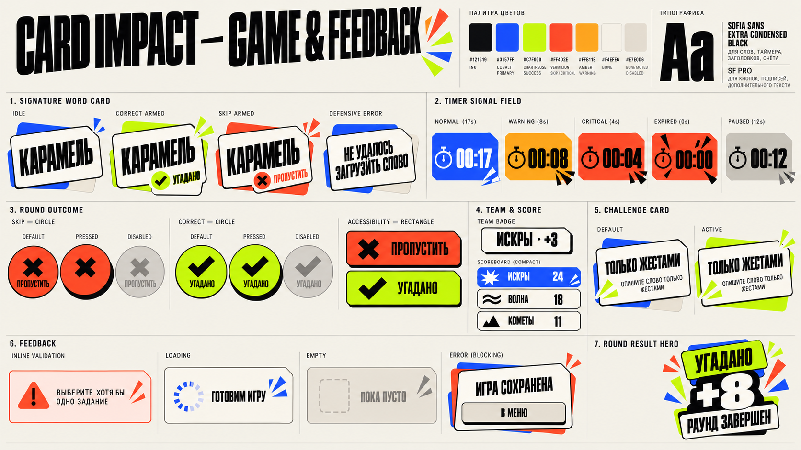

# Card Impact Component Library v1

Статус: **утверждённая рабочая библиотека**.

Этот документ превращает решения этапов 1–4 в систему компонентов. Он описывает визуальные и интерактивные правила, но не является SwiftUI-реализацией.

## Главное решение

Библиотека строится в четыре слоя:

```text
Foundations     цвета · типографика · размеры · motion
      ↓
Primitives      cut corner · hard shadow · card stack · impact mark
      ↓
Controls        button · step navigation · stepper · toggle · selection
      ↓
Compositions    live card · round result · scoreboard · status panel
```

Компонент получает публичное имя только тогда, когда:

- повторяется минимум в двух местах;
- имеет собственные состояния или интерактивную логику;
- либо является уникальным, но критичным игровым объектом со сложным контрактом.

Похожая геометрия не означает одинаковую семантику. `StepNavigationControl` и `RoundOutcomeControls` используют круги, но остаются разными компонентами: у них разные размеры, иерархия, доступность, haptic и последствия действия.

## Визуальные борды

### Actions & Setup



### Game & Feedback



Борды фиксируют композицию, пропорции и характер. Точные значения и допустимые состояния определяются Markdown-спецификацией. Если изображение и документ расходятся, приоритет у документа.

## 1. Общие правила компонентов

### Состояние не кодируется только цветом

- success: chartreuse + checkmark или слово `УГАДАНО`;
- skip/danger: vermilion + xmark или явная destructive-подпись;
- warning: amber + warning-symbol или текст;
- selected: рамка, symbol и изменение композиции, а не только fill;
- disabled: отсутствие hard shadow, muted surface и ослабленный content;
- loading: сохранение размеров компонента и явный progress indicator.

### Физика нажатия

Pressed-состояние одинаково для всех физических controls:

- face смещается вниз на 3–4 pt;
- hard shadow уменьшается до 1 pt;
- допустим scale `0.985`;
- fill не затемняется;
- icon и label двигаются вместе;
- действие срабатывает по semantic event, а не по началу декоративной анимации.

### Touch target

- абсолютный минимум: `44 × 44 pt`;
- целевой минимум для setup: `48 × 48 pt`;
- `Back`: визуально 64 pt;
- `Forward`: визуально 76 pt;
- игровые исходы: 76 / 84 / 88 pt по доступной ширине;
- маленький glyph не уменьшает tappable area.

### Focus и клавиатурная навигация

Accessibility focus обозначается внешней рамкой 3 pt с зазором 3 pt. Рамка не меняет layout и не заменяет системную VoiceOver-индикацию.

### Длинный текст

- action label: максимум две строки, выравнивание по центру;
- setting и selection row: максимум две строки, затем рост высоты;
- игровое слово: максимум две строки и минимум 40 pt;
- текст не обрезается ради сохранения декоративной высоты;
- при accessibility-размерах горизонтальные группы перестраиваются вертикально.

## 2. Foundations и primitives

### `CutCornerRectangle`

Внутренний shape, а не готовый control.

| Size | Radius | Top-right cut |
| --- | ---: | ---: |
| compact | 8 pt | 12 pt |
| action | 18 pt | 14 pt |
| card | 24 pt | 18 pt |
| hero | 24 pt | 24 pt maximum |

Срез существует только в правом верхнем углу. Кнопки назад/вперёд и игровые исходы используют круг и не получают срез.

### `FlatShadowSurface`

Внутренний construction primitive: face + zero-blur offset layer. Он не определяет цвет, роль или действие.

| Level | Offset | Use |
| --- | --- | --- |
| small | `0 × 3` | badge, compact control |
| action | `0 × 5` | button, step control |
| card | `0 × 8` | content card |
| hero | `0 × 12` | result/victory only |

На Ink-фоне используется контрастная Bone-подложка. Чёрная тень на чёрном фоне не допускается.

### `CardStack`

- максимум две подложки;
- подложки не интерактивны и не содержат текст;
- idle использует neutral/brand accents;
- semantic success/danger появляется только во время outcome preview/commit;
- удаление подложек при Reduce Transparency не требуется: они непрозрачные.

### `ImpactMark`

Декоративные варианты: `burst`, `speed`, `snap`.

- максимум три элемента;
- один цвет на событие;
- длительность 160–300 ms;
- не участвует в layout и accessibility tree;
- запрещён как постоянный фон или loading animation.

## 3. Actions

### `ImpactButton`

Текстовое действие общего интерфейса.

| Property | Contract |
| --- | --- |
| Height | 60 pt standard, 56 pt compact |
| Horizontal padding | 24 pt |
| Shape | action radius 18, cut 14 |
| Typography | `actionLabel` |
| Icon | optional leading, 24 pt |
| Label | one or two lines |

Roles:

| Role | Fill | Content | Border | Use |
| --- | --- | --- | --- | --- |
| `primary` | actionPrimary | textOnDark | none | один главный CTA |
| `secondary` | surfacePrimary | textOnLight | 2 pt strong | правила, дополнительное действие |
| `destructive` | feedbackDanger | textOnLight | 2 pt strong | подтверждённый выход/сброс |

States: `default`, `pressed`, `disabled`, `loading`, `focused`.

Rules:

- `loading` сохраняет label и добавляет compact spinner слева, чтобы ширина не прыгала;
- `disabled` не получает shadow, motion, sound или haptic;
- success не является role `ImpactButton`: краткий success-feedback живёт в результате действия;
- на одном экране не показываются два визуально равных primary buttons.

### `StepNavigationControl`

Парная композиция для линейного сценария.

| Element | Size | Fill | Content | Shadow |
| --- | ---: | --- | --- | --- |
| Back | 64 pt | surfacePrimary | Ink left arrow 28 pt | 3 pt |
| Forward | 76 pt | actionPrimary | Bone right arrow 32 pt | 5 pt |

Public inputs:

- `canGoBack`;
- `canGoForward`;
- `isForwardLoading`;
- `forwardAccessibilityLabel`;
- callbacks `onBack` и `onForward`.

States:

- Back: default, pressed, disabled, focused;
- Forward: default, pressed, disabled, loading, focused.

Rules:

- control закреплён в нижней safe-area action zone;
- Back слева, Forward справа;
- Back никогда не становится vermilion и не использует xmark;
- disabled Forward остаётся на месте, но теряет shadow и semantic fill;
- причина disabled показывается рядом с полем, а не внутри стрелки;
- компонент не решает, валиден ли шаг, и не хранит setup state.

### `RoundOutcomeControls`

Игровая пара с равным весом действий.

| Element | Semantic role | Symbol | Position |
| --- | --- | --- | --- |
| Skip | feedbackDanger | xmark + `ПРОПУСТИТЬ` | left |
| Correct | feedbackSuccess | checkmark + `УГАДАНО` | right |

States: `default`, `pressed`, `disabled`, `focused`.

Rules:

- одинаковый размер обоих controls;
- на Ink используется Bone offset layer 4 pt;
- tap и swipe вызывают один semantic intent;
- компонент получает общий `isInputLocked`, а не отдельные случайные disabled-флаги;
- во время commit оба действия блокируются;
- при accessibility-размерах круги заменяются прямоугольными action cards с полными labels и symbols;
- destructive confirmation сюда не входит: skip не считается ошибкой пользователя.

### `UtilityIconButton`

Для `pause`, `close`, `info` и других одиночных системных действий.

- visual size 44 или 48 pt;
- circle, Bone fill, Ink symbol;
- symbol 20–24 pt;
- full accessibility label обязателен;
- success/danger roles запрещены;
- не используется для Back/Forward или round outcomes.

## 4. Setup controls

### `SetupHeader`

Композиция из display title и progress label `ШАГ N ИЗ 3`.

- title использует `screenTitle` или `displayHero` по высоте экрана;
- progress — `caption`/uppercase;
- может иметь один controlled rotation до 2°;
- не содержит Back button: навигация живёт в нижней зоне.

### `ValueStepperCard`

Карточка для дискретных числовых настроек. Slider исключён.

| Element | Specification |
| --- | --- |
| Minimum width | 148 pt |
| Preferred pair | two equal columns |
| Value | `displayHero`, tabular where useful |
| Minus / Plus | 48 pt minimum touch target |
| Repeat | system long-press cadence |
| Bounds | button disabled at limit |

Product variants:

- `targetScore`: 20–200, step 5, default 60;
- `roundDuration`: 10–120 sec, step 5, default 20.

Expressive color exception:

- целевая пара может использовать raw palette accents `chartreuse500` и `vermilion500` как плакатные поля;
- это закрытые product variants, а не произвольный `Color` parameter;
- на карточках нет success/danger symbols, поэтому цвет не сообщает состояние;
- labels и units остаются обязательными;
- такая двухцветная пара разрешена только в hero-блоке Game Pulse; в остальных местах semantic colors сохраняют строгие роли.

### `SettingRow`

- minimum height 56 pt;
- leading label, optional one-line explanation, trailing native `Toggle`;
- surface `backgroundElevated` на Ink или `surfacePrimary` на Bone;
- системный Toggle сохраняет привычную механику iOS, tint = actionPrimary;
- вся строка может переключать значение, но VoiceOver не должен объявлять два отдельных одинаковых действия;
- states: off, on, disabled, focused.

### `FrequencyPicker`

Четыре фиксированных значения: `ВЫКЛ`, `РЕДКО`, `ЧАСТО`, `ВСЕГДА`.

- standard: единый segmented field высотой 48 pt;
- selected: Cobalt fill + Bone text;
- unselected: Bone fill + Ink text;
- divider 1 pt Ink;
- labels не сокращаются;
- при accessibility-размерах превращается в вертикальный single-choice list, а не сжимает сегменты.

### `ChallengeSelectionRow`

- minimum height 56 pt;
- leading semantic pictogram;
- label до двух строк;
- trailing square checkbox 32 pt;
- default: empty Ink outline;
- selected: Cobalt fill + checkmark;
- validation error: Vermilion border + warning text вне строки;
- disabled: muted surface, checkbox остаётся различимым;
- states: default, pressed, selected, disabled, validationError, focused.

Checkbox не использует круг, чтобы не конкурировать с игровыми outcome controls.

### `CategoryCard`

- minimum height 96 pt;
- title максимум две строки;
- optional short descriptor;
- default: Bone + Ink border;
- selected: Chartreuse face + explicit checkmark/label `ВЫБРАНО`;
- disabled: muted surface;
- states: default, pressed, selected, disabled, focused.

Category selection не использует vermilion: сложность категории не является опасностью.

### `TeamCard`

Используется в Line-up.

- minimum height 88 pt;
- team name — display style;
- team color занимает face или leading band;
- geometric team marker всегда показывается вместе с цветом;
- optional trailing remove control получает отдельный accessibility label;
- ручное редактирование имени не входит в v1;
- duplicate generated name является нарушением domain invariant, а не validation state карточки;
- states: default, pressed, disabled, focused.

Удаление команды не превращает всю TeamCard в destructive fill. Destructive цвет появляется только на явном remove action или в подтверждении.

### `AddTeamSlot`

- minimum height 72 pt;
- enabled: dashed Bone outline, plus и `ДОБАВИТЬ КОМАНДУ`;
- maximum: muted surface, no shadow, `МАКСИМУМ 5 КОМАНД`;
- states: default, pressed, disabled, focused;
- компонент не генерирует имя и не считает команды.

## 5. Game components

### `SignatureWordCard`

Критический игровой компонент. Полная геометрия и gesture contract находятся в [10-live-card-spec.md](10-live-card-spec.md).

Visual states:

- `idle`;
- `previewCorrect(progress)`;
- `armedCorrect`;
- `previewSkip(progress)`;
- `armedSkip`;
- `resolving`;
- `defensiveError`.

Rules:

- idle underlays никогда не semantic success/danger;
- card face не выбирает outcome и не меняет score;
- presentation progress передаётся снаружи gesture layer;
- outgoing snapshot отделён от нового current word;
- во время `resolving` input locked;
- `defensiveError` не показывает пустое слово и не имитирует обычный раунд;
- accessibility actions `Угадано`/`Пропустить` дополняют, но не заменяют видимые buttons.

### `TimerSignalField`

| State | Fill | Required non-color cue |
| --- | --- | --- |
| normal | actionPrimary | stopwatch |
| warning | feedbackWarning | warning snap/label |
| critical | feedbackDanger | critical mark + one impact |
| expired | feedbackDanger | `00:00` + stop mark |
| paused | surfaceMuted | pause semantics |

- timer typography: `gameTimer`, monospaced digits;
- component renders value and state, but не отсчитывает время;
- threshold selection belongs to game state;
- no per-second pulse in normal state;
- Reduce Motion removes scale/tick but preserves state cues.

### `TeamBadge`

- compact height 44 pt, 48 pt when content requires;
- content: team marker + name + round delta, например `ИСКРЫ · +3`;
- total score здесь не показывается;
- default surface Bone, Ink text, small hard shadow;
- team identity uses color + geometric marker;
- at accessibility sizes may grow to two lines and 64 pt.

### `SavedGameCard`

- compact informational composition для Stage Door;
- team marker + name + saved phase + relevant round/time context;
- no destructive action;
- entire card is not a replacement for the explicit Continue button;
- states: available, invalid, loading.

### `TeamTurnHero`

- current team name + marker;
- queue position + round number;
- team identity may dominate the field;
- no timer or score mutation logic.

### `CompactScoreboardStrip`

- 2–5 team score cells with tabular digits;
- current team receives explicit marker;
- compact-width five-team layout may scroll horizontally;
- component preserves provided order and never sorts domain data.

### `RoundStartControl`

- explicit `ИГРАТЬ` label + 76 pt Cobalt Forward circle;
- no Back action;
- states: default, pressed, disabled, loading, focused;
- one semantic intent `startRound`;
- separate from `StepNavigationControl` because it starts game time.

### `ScoreboardRow`

Content: rank, marker, team name, total score, optional winner crown.

Variants:

- `standard`;
- `currentTeam`;
- `winner`;
- `compact`.

Rules:

- team color occupies no more than 20% of row unless row is current/winner;
- score uses tabular digits;
- current/winner is indicated by label or symbol, not color alone;
- rows preserve stable height while scores change;
- order comes from game state; component does not sort teams.

### `ChallengeCard`

Variants:

- `preRound`: large card with title and instruction;
- `inline`: compact reminder where allowed;
- `active`: semantic emphasis after a challenge is assigned.

Rules:

- instruction is always visible before Play;
- no challenge is invented or randomly chosen inside the component;
- title display max two lines, instruction SF Pro body;
- active challenge keeps a Bone face, explicit challenge symbol and restrained Cobalt/neutral underlay; Chartreuse remains reserved for success.

### `RoundResultHero`

Purpose: reveal round delta, not full game victory.

- result value `+N` uses `scoreHero`;
- one semantic accent dominates;
- optional breakdown follows below;
- completion motion 520 ms maximum;
- content is final and readable from first settled frame;
- component does not animate score by mutating the source value.

### `ScoreBreakdown`

- guessed, skipped, optional penalty and final score cells;
- penalty cell is omitted when the rule is off;
- final total is already clamped by domain scoring;
- no calculation or score mutation inside the component.

### `WordOutcomeList`

- resolved words in round order;
- explicit correct/skip symbol and label;
- unresolved timer-zero word is absent;
- stable row identity is provided by the feature layer.

### `RoundAdvanceControl`

- next-team preview + Cobalt Forward circle;
- no Back action;
- states: default, pressed, disabled, loading, focused;
- one semantic intent `advanceToNextTeam`;
- accessibility layout becomes a full-width text action.

### `VictoryHero`

Separate from `RoundResultHero` because its hierarchy and choreography are intentionally stronger.

- winner name first;
- total score second;
- controlled multi-color burst only here;
- 720 ms maximum;
- no looping confetti;
- final scoreboard remains a separate `Scoreboard` composition.

## 6. Feedback and overlays

### `InlineValidationMessage`

- Vermilion warning symbol + concise text;
- typography `bodySmall` semibold;
- appears directly below the invalid group;
- 8 pt gap from source control;
- fade + 8 pt rise, 200 ms;
- disappearance 120 ms;
- does not shake the full screen;
- VoiceOver announcement uses `.assertive` only when continuation is blocked.

### `StatusPanel`

Variants:

| State | Content | Action |
| --- | --- | --- |
| loading | progress + short label | none/cancel only if real operation supports it |
| empty | neutral symbol + explanation | optional primary action |
| recoverableError | warning + explanation | retry or safe exit |
| blockingError | clear title + preservation status | safe exit required |

Rules:

- loading показывается только при реальной задержке, не как декоративный interstitial;
- panel uses Bone surface and Ink content;
- error action не становится red автоматически: safe recovery is primary/secondary, destructive is reserved for data loss;
- `defensive no-word` uses blockingError semantics but retains the Signature Card silhouette.

### `PauseOverlay`

Это игровая composition, а не универсальная modal card.

- solid Ink scrim 88%, no blur;
- actions: Continue, Rules, Menu;
- timer stops before overlay appears;
- background return shows settled paused state;
- active controls removed from accessibility tree;
- standard iOS `confirmationDialog` is used only if leaving may discard or replace state.

### System dialogs

Для destructive confirmations используется системный `confirmationDialog`/`alert`, если брендированная композиция не добавляет новой информации. Не создаётся отдельный универсальный Card Impact alert ради визуального единства.

## 7. State matrix

`—` означает, что состояние не должно существовать у компонента.

| Component | Pressed | Selected | Disabled | Loading | Success | Warning | Error | Focused |
| --- | :---: | :---: | :---: | :---: | :---: | :---: | :---: | :---: |
| ImpactButton | ✓ | — | ✓ | ✓ | — | — | destructive role | ✓ |
| StepNavigationControl | ✓ | — | ✓ | Forward | — | — | external validation | ✓ |
| RoundOutcomeControls | ✓ | — | ✓ | — | Correct | — | Skip is not error | ✓ |
| UtilityIconButton | ✓ | — | ✓ | — | — | — | — | ✓ |
| ValueStepperCard | ✓ | — | bounds | — | — | — | external validation | ✓ |
| SettingRow | ✓ | On | ✓ | — | — | — | — | ✓ |
| FrequencyPicker | ✓ | ✓ | ✓ | — | — | — | external validation | ✓ |
| ChallengeSelectionRow | ✓ | ✓ | ✓ | — | — | — | ✓ | ✓ |
| CategoryCard | ✓ | ✓ | ✓ | — | — | — | — | ✓ |
| TeamCard | ✓ | — | ✓ | — | — | — | — | ✓ |
| AddTeamSlot | ✓ | — | ✓ | — | — | — | — | ✓ |
| SignatureWordCard | gesture | outcome preview | input lock | — | ✓ | — | defensive | VoiceOver |
| TimerSignalField | — | — | paused | — | — | ✓ | expired | VoiceOver |
| ScoreboardRow | — | current/winner | — | — | winner | — | — | VoiceOver |
| ChallengeCard | — | active | — | — | — | — | — | VoiceOver |
| SavedGameCard | — | available | invalid | ✓ | — | — | invalid | VoiceOver |
| RoundStartControl | ✓ | — | ✓ | ✓ | — | — | external blocking | ✓ |
| RoundAdvanceControl | ✓ | — | ✓ | ✓ | — | — | external blocking | ✓ |
| StatusPanel | optional action | — | — | ✓ | — | — | ✓ | VoiceOver |

## 8. Screen recipes

Recipes validate that the library can assemble the accepted experience without local visual forks.

| Screen | Components |
| --- | --- |
| Stage Door | screen-local brand lockup, SavedGameCard, ImpactButton, StatusPanel when needed |
| Line-up | SetupHeader, TeamCard, AddTeamSlot, StepNavigationControl |
| Game Pulse | SetupHeader, ValueStepperCard, SettingRow, FrequencyPicker, ChallengeSelectionRow, StepNavigationControl, InlineValidationMessage |
| Word Deck | SetupHeader, CategoryCard, StepNavigationControl |
| Round Call | TeamTurnHero, ChallengeCard, CompactScoreboardStrip, RoundStartControl |
| Live Card | TeamBadge, UtilityIconButton.pause, TimerSignalField, SignatureWordCard, RoundOutcomeControls |
| Round Hit | RoundResultHero, ScoreBreakdown, WordOutcomeList, ScoreboardRow, RoundAdvanceControl |
| Victory Slam | VictoryHero, ScoreboardRow, ImpactButton |

Screen-local elements are allowed when they are truly unique and contain no reusable logic. `BrandLockup` is intentionally not generalized into a universal hero component.

## 9. SwiftUI naming contract

Recommended public types:

```text
CardImpactColor
CardImpactTypography
CardImpactSpacing
CardImpactRadius
CardImpactShadow
CardImpactMotion

ImpactButton
StepNavigationControl
RoundOutcomeControls
UtilityIconButton

SetupHeader
ValueStepperCard
SettingRow
FrequencyPicker
ChallengeSelectionRow
CategoryCard
TeamCard
AddTeamSlot

SignatureWordCard
TimerSignalField
TeamBadge
SavedGameCard
TeamTurnHero
CompactScoreboardStrip
RoundStartControl
ScoreboardRow
ChallengeCard
RoundResultHero
ScoreBreakdown
WordOutcomeList
RoundAdvanceControl
VictoryHero

InlineValidationMessage
StatusPanel
PauseOverlay
```

Recommended semantic enums:

```text
ImpactButtonRole        primary · secondary · destructive
ValueStepperKind       targetScore · roundDuration
TimerSignalState       normal · warning · critical · expired · paused
WordCardVisualState    idle · previewCorrect · armedCorrect · previewSkip · armedSkip · resolving · defensiveError
ScoreboardRowStyle     standard · currentTeam · winner · compact
StatusPanelState       loading · empty · recoverableError · blockingError
```

Implementation boundaries:

- `isPressed` comes from `ButtonStyle`/gesture state, not from feature ViewModel;
- `isEnabled` comes from environment or explicit feature policy;
- loading, selected and semantic state are explicit inputs;
- components do not perform navigation, validation, scoring, random choice, persistence or timer ownership;
- domain models may be adapted into compact display models at the feature boundary;
- raw `Color` is not accepted by public controls except documented team identity input;
- unknown variants are not expressed through boolean combinations such as `isRed`, `isBig`, `hasShadow`.

## 10. Responsive behavior

### Width up to 375 pt

- screen inset 20 pt;
- outcome controls 76 pt;
- ValueStepperCard pair may reduce internal padding but remains two columns while labels fit;
- game word may scale to 40 pt minimum;
- decorative marks reduce before functional content.

### Standard iPhone

- screen inset 24 pt;
- outcome controls 84 pt;
- preferred component dimensions apply.

### Width 430 pt and above

- screen inset 32 pt;
- content max width 600 pt;
- outcome controls 88 pt;
- extra width increases whitespace, not line length without limit.

### Short height / landscape

- hero spacing compresses first;
- Setup screens may scroll, bottom navigation remains safe-area pinned;
- Live Card remains non-scroll and prioritizes timer, word and outcomes;
- secondary decoration is removed before control size drops.

### Dynamic Type accessibility sizes

- segmented FrequencyPicker becomes vertical selection list;
- RoundOutcomeControls become rectangular action cards;
- TeamBadge can grow to 64 pt and two lines;
- setting rows and category cards grow vertically;
- fixed display typography uses bounded scaling plus complete VoiceOver labels.

## 11. Deliberately rejected abstractions

- `UniversalCard` with dozens of flags;
- one `CircleButton` for Back, Forward, Pause, Skip and Correct;
- arbitrary `accentColor` on public components;
- generic `StatusColor` inferred from fill;
- screen-wide `isLoading` that disables unrelated controls;
- custom Toggle that loses system interaction behavior;
- custom alert used only to match the brand;
- one hero component shared by Round Result and Victory;
- a component for every decorative sticker or impact mark placement.

## 12. Behavioral dependencies before implementation

The library exposes states required by accepted UX. Implementation must also complete these product behaviors:

- reversible setup with preserved values;
- consistent sound routing;
- shared last-word behavior;
- unique generated team names;
- playable categories and continuous word supply.

Components may render defensive states, but must not hide these behavioral gaps.

## 13. Acceptance checklist

- all eight primary screens assemble from this library plus explicitly screen-local hero art;
- Back and Forward preserve the accepted asymmetric circular construction;
- Skip and Correct remain equal game outcomes and are not implemented as navigation buttons;
- no component depends on color alone for meaning;
- pressed, disabled, loading, selected and error are visibly distinct;
- disabled controls have no hard shadow or haptic;
- all controls have at least 44 pt touch targets;
- all interactive components have explicit accessibility labels and focus states;
- long Russian text and Dynamic Type do not truncate meaning;
- setup can scroll while Live Card remains non-scroll;
- component API accepts semantic roles, not arbitrary styling flags;
- no behavior or state transition is owned by decorative animation.
