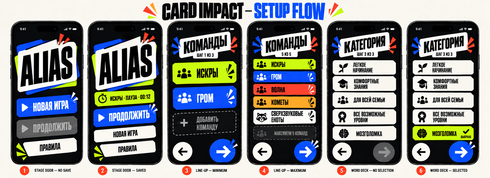

# Entry & Setup v1

Статус: **утверждённая рабочая спецификация этапа 6**.

Документ подробно определяет Stage Door, Line-up и Word Deck. Game Pulse уже зафиксирован в [09-experience-architecture.md](09-experience-architecture.md) и визуально проверен в `12-card-impact-game-pulse-v2.png`.



## 1. Stage Door

### Цель

За один взгляд предложить правильное следующее действие: начать новую игру или продолжить существующую.

### Первый объект

Card-stack lockup `ALIAS`. Он задаёт характер продукта, но занимает меньше половины полезной высоты и не конкурирует с главным действием.

### Основное действие

- без корректного сохранения: `НОВАЯ ИГРА`;
- с корректным сохранением: `ПРОДОЛЖИТЬ`;
- с некорректным сохранением: `НОВАЯ ИГРА`, а Continue остаётся видимой disabled.

### Иерархия

```text
ALIAS lockup
    ↓
saved-game context, если существует
    ↓
primary action
    ↓
secondary action
    ↓
Rules
```

### Layout и spacing

- Ink background, без scroll на стандартной высоте;
- screen inset 24 pt, compact 20 pt;
- lockup расположен в верхней/средней зоне с controlled rotation до 2°;
- actions собраны в нижней трети экрана;
- vertical gap между actions 12 pt;
- bottom inset учитывает safe area + 16 pt;
- максимальная ширина action stack 430 pt.

### Typography

- `ALIAS`: custom display lockup, не обычный текстовый title;
- action labels: `actionLabel`;
- saved context: `bodyEmphasis` + `caption`;
- системное состояние сохранения: `bodySmall`.

### Colors

- background: Ink;
- current primary: Cobalt;
- secondary: Bone;
- disabled Continue: Bone Muted, 38% Ink content, no shadow;
- saved context: Bone field с team color marker; Cobalt остаётся единственным доминирующим action color;
- invalid save использует muted surface и нейтральный текст, а не full-screen danger.

### Components

- screen-local Alias lockup;
- `SavedGameCard`;
- `ImpactButton`;
- `StatusPanel` only for recoverable load failure;
- Rules sheet;
- native replacement confirmation.

`SavedGameCard` добавляется в Component Library как compact composition:

- team name + marker;
- saved phase;
- round/time context when relevant;
- no direct destructive action;
- entire card is informational; Continue remains the tap target.

### States

#### No save

- Continue remains visible and disabled;
- New Game primary;
- Rules secondary.

#### Valid save

- saved card shows team and exact restore context;
- Continue primary;
- New Game secondary and opens replacement confirmation;
- Rules remains independent.

#### Invalid or incompatible save

- Continue disabled;
- inline status `СОХРАНЕНИЕ НЕДОСТУПНО`;
- New Game primary;
- no modal on launch and no dead end.

#### Checking save

- no loading UI for local checks shorter than 250 ms;
- after 250 ms, Continue keeps its geometry and shows compact loading;
- New Game and Rules stay available unless storage operation genuinely blocks them.

### Motion и interactions

- lockup enters once with 280 ms rise/fade;
- actions settle with 40 ms stagger, maximum three elements;
- saved card appears without celebration motion;
- Continue press follows standard physical button motion;
- invalid-save status uses a single 160 ms fade.

### iPhone adaptation

- short screens reduce lockup height first;
- at accessibility sizes, lockup reduces but actions grow vertically;
- saved metadata wraps to two lines;
- landscape uses a two-column layout: lockup left, actions right.

### SwiftUI boundary

- Stage Door receives `SavedGameAvailability`: `checking`, `none`, `available(summary)`, `invalid`;
- screen does not decode or validate save data;
- Continue routes through typed restore intent;
- Rules uses a separate sheet route and never touches saved state.

## 2. Line-up — шаг 1 из 3

### Цель

Сформировать 2–5 различимых команд как быстрый игровой roster, а не регистрационную форму.

### Первый объект

Вертикальный stack цветных `TeamCard`.

### Основное действие

Forward к Game Pulse, когда список содержит 2–5 различных автоматически созданных команд.

### Product decision

В v1 названия команд автоматически генерируются и не редактируются вручную. Экран поддерживает только:

- добавить команду;
- удалить команду, если останется минимум две;
- перейти дальше;
- вернуться назад.

Поле ввода имени и editing-state исключаются: они не поддержаны продуктовым контрактом и добавляют лишнюю форму перед вечеринкой.

### Иерархия

```text
КОМАНДЫ · ШАГ 1 ИЗ 3
team stack
add / maximum slot
fixed Back · Forward zone
```

### Layout и spacing

- header scrolls with content;
- cards use 12 pt vertical gap;
- default TeamCard minimum height 88 pt;
- list scrolls for 4–5 teams and Dynamic Type;
- bottom navigation is pinned above safe area;
- scroll content receives bottom padding equal to action zone + 24 pt.

### Typography

- screen title: `screenTitle`;
- team name: Sofia Sans Extra Condensed, 36–44 pt depending on card width;
- step and count: `caption` uppercase;
- max-state label: `bodyEmphasis`.

### Colors

- each team uses its fixed team color plus geometric marker;
- Forward remains Cobalt regardless of active team color;
- remove action uses Vermilion only on the icon/action itself;
- team card does not become red when removable.

### Components

- `SetupHeader`;
- `TeamCard` display variant;
- `AddTeamSlot`;
- `StepNavigationControl`.

`AddTeamSlot` states:

- enabled: dashed Bone outline + plus + `ДОБАВИТЬ КОМАНДУ`;
- pressed: standard physical motion;
- maximum: muted + `МАКСИМУМ 5 КОМАНД`, not tappable.

### States and boundaries

#### Initial / minimum

- exactly two teams;
- remove actions hidden, not merely disabled;
- Add Team enabled;
- Forward enabled.

#### Three or four teams

- each card exposes an explicit remove action;
- Add Team enabled;
- deletion animates list reflow without moving bottom navigation.

#### Five teams

- Add Team slot stays visible but disabled as boundary feedback;
- Forward remains enabled.

#### Duplicate generated name

Это не пользовательская validation state, а нарушение product invariant. Соответствующая карта не должна перекладывать исправление на игрока. Генератор обязан выбрать свободное имя до вставки команды.

### Motion и interactions

- adding card: 200 ms rise + fade, list scrolls to new card;
- removing card: 160 ms collapse after semantic removal;
- Forward transition: content left 20 pt, 280 ms;
- Back transition: content right 20 pt, 280 ms;
- repeated add while insertion is active is ignored.

### iPhone adaptation

- compact widths keep full-width cards;
- five-team layout scrolls rather than reducing cards below 72 pt;
- long generated name wraps to two lines;
- at accessibility sizes, team marker and remove action occupy separate columns;
- landscape uses two-column adaptive grid only if every card keeps minimum width 240 pt.

### SwiftUI boundary

- list identity uses `Team.id`, never name;
- generated name uniqueness belongs to ViewModel/domain logic;
- `TeamCard` receives a display model and remove intent;
- `StepNavigationControl` receives validation booleans but does not count teams.

## 3. Game Pulse — шаг 2 из 3

Полный visual contract зафиксирован в [09-experience-architecture.md](09-experience-architecture.md) и [12-component-library.md](12-component-library.md).

Stage 6 добавляет только flow requirements:

- Back returns to the same Line-up draft;
- Forward stores confirmed preferences and opens Word Deck;
- invalid challenge selection keeps Forward disabled;
- scroll position is not required to persist after leaving the screen, but values are;
- returning from Word Deck restores every selected value.

## 4. Word Deck — шаг 3 из 3

### Цель

Выбрать один playable word deck и явно подтвердить начало матча.

### Первый объект

Пять category cards как единая компактная колода.

### Основное действие

Forward после выбора доступной категории.

### Product decision

Тап по категории только выбирает её. Матч запускается отдельным Forward.

Это защищает от случайного старта и сохраняет навигационную грамматику трёх setup-шагов. Решение считается частью целевого поведения независимо от текущей реализации.

### Layout и spacing

- header scrolls with content;
- category cards: minimum 88 pt, gap 8–12 pt;
- full set may scroll;
- bottom Back/Forward zone fixed;
- selected card may rise 2 pt but не меняет высоту списка.

### Typography

- title: `screenTitle`;
- category title: 24–32 pt condensed display, max two lines;
- optional descriptive content requires separate approved copy; UI does not invent difficulty claims from category names;
- state labels use `caption` uppercase.

### Colors

- default: Bone surface;
- selected: Chartreuse + checkmark + `ВЫБРАНО`;
- unavailable: Bone Muted, no shadow, explicit `НЕТ СЛОВ`;
- Forward: Cobalt only when playable selection exists.

### Components

- `SetupHeader`;
- `CategoryCard`;
- `InlineValidationMessage`;
- `StatusPanel` for all-categories-unavailable;
- `StepNavigationControl`.

### States

#### No selection

- all playable cards neutral;
- Forward disabled;
- no error message until the user attempts to continue or availability itself is invalid.

#### Selected

- exactly one card selected;
- previous selection returns to default;
- Forward active;
- Forward creates the active save and opens first Round Call.

#### One unavailable category

- card visible but disabled;
- explicit `НЕТ СЛОВ`;
- remaining categories stay selectable;
- an unavailable card cannot be selected or confirmed.

#### Every category unavailable

- blocking StatusPanel `НЕТ ДОСТУПНЫХ НАБОРОВ`;
- Forward disabled;
- Back remains available;
- normal setup cannot complete.

Эти unavailable states — defensive presentation. Целевой продукт должен предоставлять playable pool для каждой предлагаемой категории.

### Motion и interactions

- selection: 160 ms face rise + checkmark lock;
- previous selection settles simultaneously;
- no navigation on card tap;
- Forward uses setup transition 280 ms;
- active save is created only after Forward intent is accepted;
- repeated Forward is ignored while route transition is active.

### iPhone adaptation

- compact width keeps one column;
- large width may use a two-column grid only if reading order remains stable;
- accessibility sizes use one column and allow title growth;
- bottom actions never cover the fifth category.

### SwiftUI boundary

- selection state lives in setup ViewModel;
- category availability is explicit input, not derived from accent/color;
- Forward passes one `WordsCategory` into the final configuration;
- save creation and navigation are coordinated outside `CategoryCard`;
- component never reads word pools directly.

## 5. Setup flow and draft persistence

```text
Stage Door
   │ New Game
   ▼
Line-up ⇄ Game Pulse ⇄ Word Deck
                           │ Confirm
                           ▼
                      Round Call + first save
```

Accepted UX behavior:

- Back between setup steps preserves all draft choices;
- setup does not create an active game save before category confirmation;
- leaving setup to Stage Door discards the setup draft;
- replacing an existing saved game is confirmed before Line-up opens;
- once replacement is confirmed, the old save is deleted and cannot be restored.

Эти правила являются целевым поведением setup и должны быть реализованы вместе с новой навигацией.

## Acceptance checklist

- Stage Door always presents one obvious primary action;
- Continue remains visible in every save state;
- Rules never shares Continue behavior;
- two teams cannot be reduced to one;
- five teams cannot become six;
- team identity never depends only on color;
- setup Back preserves draft values between steps;
- category tap selects but does not unexpectedly start the match;
- unavailable categories cannot start a game;
- first game save appears only when setup is confirmed;
- bottom navigation never covers scroll content;
- all screens remain usable with long Russian text and Dynamic Type.
