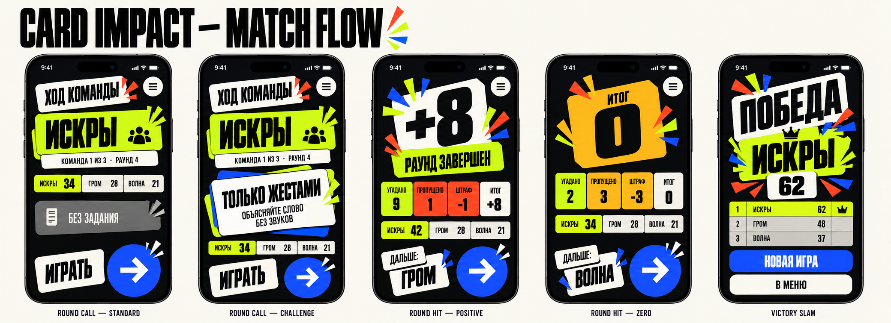

# Match & Results v1

Статус: **утверждённая рабочая спецификация этапа 6**.

Документ определяет Round Call, Round Hit и Victory Slam. Live Card, Pause и Resume подробно описаны в [10-live-card-spec.md](10-live-card-spec.md) и [11-motion-spec.md](11-motion-spec.md).



## 1. Match phase map

```text
Round Call
    │ Играть
    ▼
Live Card ── Pause ⇄ Resume Countdown
    │ timer 0
    ├── target not reached ──▶ Round Hit ──▶ next Round Call
    └── target reached ──────▶ Victory Slam
```

Match lives in one phase container. Screen transitions reflect game phase; they do not create independent duplicate sources of timer, score or current team.

## 2. Round Call

### Цель

Передать iPhone правильной команде, дать ей прочитать задание и только после явного действия запустить время.

### Первый объект

Большое team field с названием текущей команды.

### Основное действие

`ИГРАТЬ` рядом с крупным Cobalt Forward control.

### Иерархия

```text
ХОД КОМАНДЫ
team name
queue position · round number
challenge / no challenge
compact scoreboard
ИГРАТЬ →
```

Team и challenge визуально важнее scoreboard. Время на этом экране не отображается как активный countdown.

### Layout и spacing

- non-scroll on standard height when no challenge;
- challenge version may scroll on compact height;
- header and menu action occupy top safe area;
- team field uses 32 pt vertical separation from metadata;
- scoreboard is a compact strip, not a full table;
- launch zone pinned above bottom safe area;
- content receives bottom padding equal to launch zone + 24 pt.

### Typography

- `ХОД КОМАНДЫ`: `screenTitle`;
- team name: `displayHero`, one or two lines;
- queue/round metadata: `bodyEmphasis` + tabular digits;
- challenge title: `screenTitle` or 32 pt display;
- challenge instruction: SF Pro body;
- Play: `actionLabel`.

### Colors

- current team field uses team color + geometric marker;
- challenge card keeps a Bone face with Cobalt/neutral underlay and explicit challenge symbol; it does not compete with team identity or Play;
- no challenge uses Bone Muted badge `БЕЗ ЗАДАНИЯ`;
- launch control remains Cobalt;
- no Vermilion unless an actual blocking error appears.

### Components

- `TeamTurnHero`;
- `ChallengeCard`;
- `CompactScoreboardStrip`;
- `RoundStartControl`;
- `UtilityIconButton.menu`.

Stage 6 adds three repeatable compositions to the library:

#### `TeamTurnHero`

- team marker + name;
- queue position;
- round number;
- no score mutation or ordering logic.

#### `CompactScoreboardStrip`

- 2–5 compact score cells;
- current team emphasized;
- horizontal scroll only if 5 teams and compact width;
- scores use tabular digits;
- order comes from game state.

#### `RoundStartControl`

- explicit text `ИГРАТЬ` + 76 pt Cobalt Forward circle;
- no Back control;
- one semantic intent `startRound`;
- disabled when round preparation is not playable;
- not implemented as a partially configured `StepNavigationControl`.

### States

#### Standard round

- `БЕЗ ЗАДАНИЯ` shown as quiet neutral badge;
- team, score and Play remain primary information.

#### Challenged round

- title and full instruction shown before Play;
- timer remains inactive;
- challenge card never truncates the action rule.

#### Preparing

- local setup is expected to be synchronous;
- if word deck/challenge preparation exceeds 250 ms, Play preserves geometry and shows loading;
- repeated Play is ignored.

#### Unplayable preparation

- no empty Live Card transition;
- blocking status identifies that a word cannot be loaded;
- safe action `В МЕНЮ` saves the game;
- this defensive state does not resolve empty categories or exhausted word supply.

### Motion и interactions

- entrance 280 ms: team field first, challenge second, scoreboard third;
- Play transition follows the 340 ms Round Call → Live Card choreography;
- active timer starts only when Live Card is interactive;
- menu action saves and returns without starting gameplay.

### iPhone adaptation

- compact height reduces decoration, then team field padding;
- challenge instruction may grow to three body lines;
- five-team score strip scrolls horizontally with current team initially visible;
- accessibility layout stacks Play text above a full-width primary action card rather than relying on icon-only Forward.

### SwiftUI boundary

- screen receives immutable round preparation display data;
- random challenge selection happens before render;
- RoundStartControl forwards intent only;
- phase transition and timer start are one ViewModel operation;
- menu action checkpoints state before route dismissal.

## 3. Round Hit

### Цель

Объяснить результат завершившегося раунда и подготовить физическую передачу следующей команде.

### Первый объект

Итог раунда `+N` или `0`.

### Основное действие

`СЛЕДУЮЩАЯ КОМАНДА` / Forward, если победа ещё не достигнута.

### Иерархия

```text
round total
score breakdown
word outcomes
updated scoreboard
next team
Forward
```

### Layout и spacing

- screen scrolls when word outcome list does not fit;
- result hero occupies top 30–38% of initial viewport;
- breakdown uses equal-width compact cells;
- word list follows below breakdown;
- scoreboard follows word list or appears as a compact strip on short screens;
- next-team action zone remains pinned.

### Typography

- result: `scoreHero`;
- result label: `screenTitle`;
- breakdown value: `sectionTitle` with tabular digits;
- words: `bodyEmphasis`;
- next team: 40–56 pt display depending on available height.

### Colors

- positive result: Chartreuse dominant;
- zero result: Bone/Amber, not danger;
- guessed word row: checkmark + restrained Chartreuse marker;
- skipped word row: xmark + restrained Vermilion marker;
- penalty is Vermilion only when the optional penalty actually subtracts points;
- scoreboard team colors remain identity accents.

### Components

- `RoundResultHero`;
- `ScoreBreakdown`;
- `WordOutcomeList`;
- `ScoreboardRow` / `CompactScoreboardStrip`;
- `RoundAdvanceControl`.

#### `ScoreBreakdown`

Inputs:

- guessed count;
- skipped count;
- penalty count only when penalty rule is enabled;
- final non-negative total.

It displays final values immediately and never recalculates scoring.

#### `WordOutcomeList`

- exact resolved words in resolution order;
- each row carries `correct` or `skipped` symbol and label;
- unresolved word at timer zero is not included;
- stable identity must not be based only on repeated word text.

#### `RoundAdvanceControl`

- next-team preview + Cobalt Forward circle;
- intent `advanceToNextTeam`;
- no Back;
- disabled during persistence/transition only;
- at accessibility sizes becomes full-width text action.

### States

#### Positive total

- `+N` hero with Chartreuse;
- breakdown shows how the number was produced.

#### Zero total

- displays `0`, never `−N` because score floor is zero;
- no error language;
- breakdown may show penalties exceeding guessed count.

#### Penalty disabled

- skipped count stays visible;
- penalty cell is omitted rather than showing a misleading subtraction;
- final total equals guessed count.

#### No resolved words

- result `0`;
- word list uses neutral empty text `В ЭТОМ РАУНДЕ НЕТ ОТМЕЧЕННЫХ СЛОВ`;
- next-team action remains available.

#### Restored result

- final values render immediately without replaying the full result slam;
- subtle 160 ms fade is allowed;
- score is not added twice.

### Motion и interactions

- initial result choreography maximum 520 ms;
- final values are visible by the end of 520 ms;
- result count-up is presentation-only and lasts no more than 320 ms;
- restored result skips count-up;
- Forward uses 280 ms phase transition and input lock.

### iPhone adaptation

- compact width uses 2×2 breakdown grid;
- long word lists scroll;
- five-team scoreboard uses rows rather than tiny columns;
- next-team action stays outside scroll content;
- accessibility sizes replace decorative hero stack with stable flat card.

### SwiftUI boundary

- screen receives a committed `RoundResultSnapshot`;
- no score mutation occurs in the View;
- word list reads saved outcomes;
- next-team rotation happens only after accepted intent;
- outgoing phase is persisted before Round Call appears.

## 4. Victory Slam

### Цель

Объявить победителя, показать окончательный результат всех команд и завершить игровой цикл.

### Первый объект

`ПОБЕДА` + winner name.

### Основное действие

`НОВАЯ ИГРА`, открывающая Line-up нового setup.

Secondary action: `В МЕНЮ`.

### Product decision

Не используется действие `СЫГРАТЬ ЕЩЁ РАЗ`, пока не определено, какие команды, настройки и категория должны переноситься. `НОВАЯ ИГРА` имеет однозначное поведение и не создаёт скрытого reuse contract.

### Victory branch

Если итог раунда достигает target score:

- интерактивный Round Hit не показывается;
- game state сразу становится game result;
- Victory Slam включает короткий prebeat последнего `+N`, winner reveal и final scoreboard;
- пользователь не должен нажимать `Дальше`, чтобы узнать о победе.

### Layout и spacing

- winner hero occupies upper half;
- final scoreboard visible in first viewport for 2–3 teams;
- with 4–5 teams screen may scroll, actions stay pinned;
- primary and secondary actions stacked vertically;
- no Continue action after completed save deletion.

### Typography

- `ПОБЕДА`: `displayHero`;
- winner: `displayHero` or bounded 64–72 pt;
- winning score: `scoreHero`;
- scoreboard: `bodyEmphasis` + tabular score.

### Colors

- winner uses team identity plus Chartreuse success;
- one controlled multicolor burst may use Cobalt, Chartreuse and Vermilion;
- background remains Ink;
- actions remain Cobalt/Bone;
- no perpetual particle field.

### Components

- `VictoryHero`;
- `ScoreboardRow.winner` and standard rows;
- `ImpactButton.primary`;
- `ImpactButton.secondary`.

### States

#### Standard victory

- unique winner;
- all teams and final scores visible;
- active save already removed.

#### Long winner name

- two lines maximum;
- scale bounded at 40 pt minimum;
- score remains visually separate.

#### Returning after completion

- completed game is not restorable;
- Stage Door shows Continue disabled.

### Motion и interactions

- total hero choreography 720 ms;
- primary action available by 720 ms;
- no loop, autoplay sound after first sting or repeated haptic;
- Reduce Motion uses sequential static marks + fade;
- New Game and Menu ignore repeated taps during route transition.

### iPhone adaptation

- compact height reduces burst and hero whitespace;
- five-team scoreboard scrolls;
- accessibility sizes place winner, score, scoreboard and actions in reading order;
- landscape uses winner left and scoreboard/actions right.

### SwiftUI boundary

- Victory receives a final immutable game snapshot;
- save deletion belongs to game-state transition, not button action;
- screen does not infer winner by resorting mutable rows;
- New Game starts a new draft; it does not silently reuse finished configuration.

## 5. Screen transition rules

| From | Event | To | Transition |
| --- | --- | --- | --- |
| Round Call | Play accepted | Live Card | 340 ms, timer starts when interactive |
| Live Card | Pause | Pause overlay | timer stops before motion |
| Pause | Continue | Resume Countdown | 2350 ms, timer frozen |
| Live Card | Timer zero, no winner | Round Hit | result 520 ms |
| Live Card | Timer zero, winner | Victory Slam | victory 720 ms |
| Round Hit | Next Team | Round Call | 280 ms directional |
| Any game phase | Menu | Stage Door | save first, then route close |
| Victory | New Game | Line-up | fresh setup draft |
| Victory | Menu | Stage Door | Continue disabled |

## Acceptance checklist

- Round Call names the correct team before Play;
- assigned challenge and instruction are fully visible before timer starts;
- no challenge is explicitly neutral, not an empty error card;
- Play cannot create a second timer;
- Round Hit explains every scoring subtraction;
- optional penalty is not implied when disabled;
- zero score is treated as valid, not as failure;
- timer-zero unresolved word never appears in outcomes;
- restored Round Hit does not add score or replay full celebration;
- winner branch does not require a redundant confirmation tap;
- Victory shows every team and removes Continue for the completed game;
- no game result depends on animation completion.
