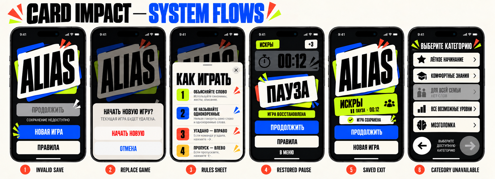

# System Flows & Edge Cases v1

Статус: **утверждённая рабочая спецификация этапа 6**.

Документ определяет overlays, восстановление, сохранение и защитные состояния, которые связывают основные экраны в надёжный продукт.

## 1. Overlay hierarchy

Используются четыре разных системных слоя, потому что у них разные задачи:

| Layer | Pattern | Purpose |
| --- | --- | --- |
| Rules | native sheet | прочитать информацию без изменения игры |
| Replace game | native confirmation dialog | подтвердить необратимое удаление save |
| Pause | full-screen game overlay | остановить активный раунд и сохранить контекст |
| Resume | full-screen countdown | безопасно вернуть игроков в активный темп |

Один универсальный Card Impact modal для всех четырёх случаев запрещён.

## 2. Replace saved game

### Trigger

На Stage Door существует корректное активное сохранение, пользователь выбирает `НОВАЯ ИГРА`.

### Presentation

Native iOS confirmation dialog:

- title: `НАЧАТЬ НОВУЮ ИГРУ?`;
- message: `ТЕКУЩАЯ ИГРА БУДЕТ УДАЛЕНА.`;
- destructive: `НАЧАТЬ НОВУЮ`;
- cancel: `ОТМЕНА`.

### Behavior

- Cancel closes dialog and changes nothing;
- destructive confirmation deletes save first, then opens Line-up;
- if deletion fails, setup does not open and save is not presented as successfully removed;
- repeated destructive tap is ignored while operation is active.

### Visual rule

Используется системная иерархия destructive action. Не создаётся брендированный красный pop-up, который хуже системного распознавания риска.

## 3. Rules sheet

### Entry points

- Stage Door;
- Pause overlay.

### Presentation

- native resizable sheet on Bone surface;
- grabber + close control;
- title `КАК ИГРАТЬ`;
- vertical numbered sections;
- content scrolls independently;
- default detent large enough to show first rule and context.

### Data isolation

- opening Rules never triggers Continue;
- saved game is not read, mutated or deleted;
- active paused timer remains frozen;
- closing Rules returns to the exact presenting state.

### Content boundary

Screen structure is approved, but final legal/gameplay wording requires a separate content pass. Temporary board copy is illustrative and does not expand the gameplay contract.

## 4. Continue and restore routing

Continue never routes to a generic game start. It restores the persisted phase:

| Saved phase | Destination |
| --- | --- |
| preparation | same Round Call, same team/round/challenge |
| active play | Pause overlay over restored Live Card |
| paused | Pause overlay over restored Live Card |
| round result | same Round Hit with committed snapshot |
| game result | impossible; completed save must already be removed |

### Restored active/paused game

- timer remains frozen;
- overlay adds label `ИГРА ВОССТАНОВЛЕНА` once;
- primary `ПРОДОЛЖИТЬ` starts the full 3–2–1 sequence;
- Rules and Menu remain available;
- no automatic countdown and no automatic timer resume.

### Loading threshold

- restore under 250 ms: no loading screen;
- restore over 250 ms: Stage Door Continue enters loading in place;
- full-screen loading appears only if navigation has already committed and restoration still requires work;
- progress does not imitate game impact motion.

### Restore failure after tap

- show recoverable `StatusPanel` with title `НЕ УДАЛОСЬ ПРОДОЛЖИТЬ`;
- primary safe action `НА ГЛАВНУЮ`;
- secondary `НОВАЯ ИГРА` opens replacement confirmation before deleting data;
- do not route into an empty game phase.

## 5. Leave game and return to Stage Door

### Decision

`В МЕНЮ` is reversible because current state is saved. It does not require an extra confirmation dialog.

Behavior:

1. active timer stops synchronously if needed;
2. phase and remaining time are checkpointed;
3. entire game route closes;
4. Stage Door appears with Continue primary;
5. compact success notice `ИГРА СОХРАНЕНА` may remain for 1.5 s.

If saving fails, route must not close as though data were safe. Show blocking error with Retry and Stay in Game.

### Motion

- no victory or success burst;
- Stage Door uses 160 ms fade;
- success notice uses checkmark + 160 ms rise/fade;
- announcement is polite and does not steal accessibility focus from Continue.

## 6. Invalid save

### Launch-time invalidity

- Continue remains visible but disabled;
- inline `СОХРАНЕНИЕ НЕДОСТУПНО`;
- New Game primary;
- Rules available;
- no blocking alert on app launch.

### Why no panic state

Invalid historical data is not an immediate user emergency. The user still has a complete forward path. Vermilion is reserved for the destructive replacement action, not for turning the home screen into an error screen.

## 7. Category availability

### One unavailable category

- card remains visible to keep the promised five-category map stable;
- uses muted surface, no shadow and label `НЕТ СЛОВ`;
- card cannot become selected;
- Forward remains disabled until another playable category is selected.

### All categories unavailable

- replace list interaction with blocking StatusPanel;
- message: `НЕТ ДОСТУПНЫХ НАБОРОВ`;
- Back remains available;
- setup cannot create a game save.

These are defensive UI states only. The product must provide playable pools instead of relying on disabled categories.

## 8. Word exhaustion during a match

Accepted defensive presentation remains:

- timer stops;
- no empty word card;
- blocking card `НЕ УДАЛОСЬ ЗАГРУЗИТЬ СЛОВО`;
- state is saved;
- safe action `В МЕНЮ`.

There is no automatic reshuffle/retry policy in the design because product behavior is unresolved. A replenishment decision is still required before implementation.

## 9. Challenge validation

- frequency Off permits an empty challenge subset;
- Rare/Often/Always require at least one selected challenge;
- error appears below the challenge selection group;
- Forward disabled, Back active;
- Select All clears error immediately;
- Clear produces error only when active frequency requires a selection;
- whole screen never shakes.

## 10. Team generation failure

Generated names must be unique before insertion. The user should not be asked to solve an internal random-selection failure.

- duplicate candidate is rejected and another unused name is chosen;
- if no unused names exist before five teams, Add Team becomes unavailable with a technical-safe neutral message;
- normal UI does not expose duplicate validation;
- the current generator must be corrected to guarantee uniqueness.

## 11. Foreground interruption matrix

| Current state | App loses foreground | Return behavior |
| --- | --- | --- |
| Stage Door/setup | keep current draft in memory | same screen, no special overlay |
| Round Call | persist preparation | same Round Call |
| Live Card | stop timer + save paused phase | Pause overlay |
| Pause | remain paused | settled Pause overlay |
| Resume countdown | cancel countdown + save pause | Pause overlay, restart from 3 on intent |
| Round Hit | persist committed result | same Round Hit, no score replay |
| Victory | completed save absent | same Victory while process lives; Home has no Continue after relaunch |

## 12. Loading, empty, error and success policy

### Loading

Use only after 250 ms real latency. Preserve component geometry and do not block unrelated actions.

### Empty

Use neutral Bone surface and explain what the user can do next. Empty is not an error unless the contract promised data.

### Error

- inline for local validation;
- StatusPanel for recoverable operation failure;
- blocking Card Impact surface only when gameplay cannot safely continue;
- system dialog for destructive confirmation.

### Success

- short checkmark/notice for save completion;
- no full-screen success screen for routine persistence;
- Chartreuse hero reserved for round success and victory.

## 13. Accessibility

- dialogs and sheets use native focus management;
- opening Rules moves focus to title;
- closing Rules returns focus to invoking control;
- restored Pause announces `Игра восстановлена. Пауза. Осталось N секунд.`;
- disabled Continue exposes reason in its accessibility hint;
- success notice is a polite announcement;
- destructive confirmation speaks consequence before actions;
- no status relies only on color or animation.

## 14. SwiftUI boundaries

- sheet/dialog visibility is presentation state; save deletion/restoration remains ViewModel/domain intent;
- `scenePhase` drives interruption intent, not view disappearance heuristics;
- route dismissal follows successful checkpoint completion;
- restore phase is decoded before destination composition;
- sheets use native SwiftUI presentation where possible;
- Pause overlay and Resume countdown remain custom because they are part of game timing and phase semantics;
- UI does not repair corrupted save data or refill word pools by itself.

## 15. Remaining product decisions

Before implementation of the full design:

1. implement Back while preserving setup draft values;
2. implement category select + explicit confirmation;
3. decide whether leaving the entire setup from Line-up discards draft without confirmation;
4. fix empty category pools;
5. make sound routing obey the game setting;
6. define shared last-word behavior;
7. guarantee unique generated team names;
8. define word-pool replenishment;
9. approve final Rules copy.

Items 1 and 2 are already accepted design decisions. Items 3–9 require either implementation work or one explicit product decision before coding that behavior.

## Acceptance checklist

- New Game never deletes a valid save without confirmation;
- Rules never changes or opens a save;
- restored active play always lands paused;
- Resume always starts from 3 and preserves remaining time;
- leaving a game checkpoints before route dismissal;
- invalid saves never crash or trap the user;
- unavailable categories cannot start an empty round;
- empty word card is never rendered;
- loading appears only for real latency;
- routine save success does not overpower gameplay feedback;
- every overlay has one clear dismissal path;
- native patterns are preserved where branding adds no UX value.
