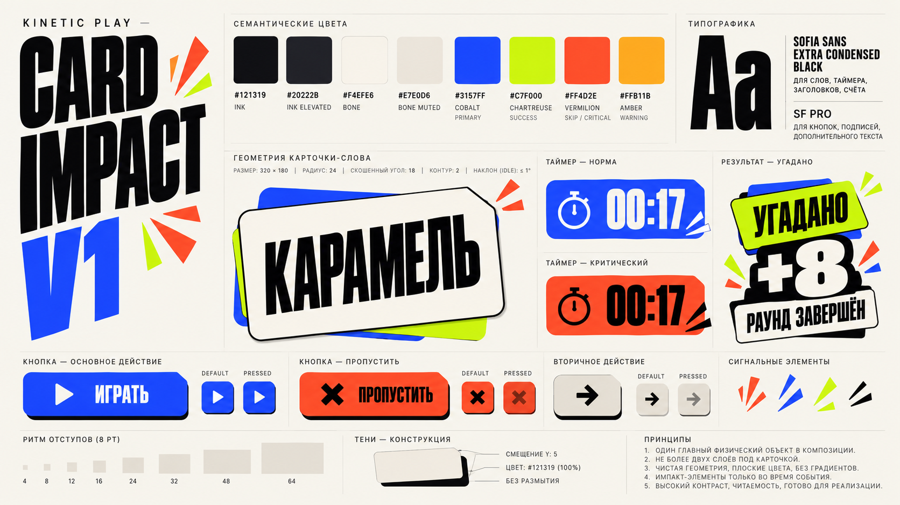

# Card Impact Foundations v1

Статус: **утверждённая рабочая основа**.

Эти документы являются источником истины для визуальной системы Kinetic Play / Card Impact. Сгенерированный style tile служит визуальным референсом, но не заменяет числовые значения и правила из Markdown.

## Документы

- [Colors](colors.md)
- [Typography](typography.md)
- [Layout and Shape](layout-and-shape.md)
- [Card Impact Language](card-impact-language.md)
- [Motion](motion.md)
- [SwiftUI Token Map](swiftui-token-map.md)

## Статус решений

Зафиксировано:

- семантическая палитра;
- контрастные текстовые пары;
- отдельная командная палитра;
- Sofia Sans Extra Condensed для display-слоя;
- SF Pro для интерфейсного текста и таймера;
- spacing и radius шкалы;
- геометрия signature card;
- flat-shadow правила;
- duration, easing и Reduce Motion tokens;
- ограничения underlay и impact marks;
- соответствие SwiftUI-токенам и semantic component naming;
- component library contract из [../12-component-library.md](../12-component-library.md).

Может уточняться после проверки на ключевом пользовательском сценарии:

- размеры display-текста на компактных iPhone;
- точный диапазон поворота карточки;
- размер скошенного угла;
- team colors после проверки на реальных названиях и турнирной таблице.

## Главный принцип

Card Impact создаёт характер за счёт одного физичного объекта и его реакции на действие. Остальная композиция остаётся спокойной, строгой и легко считываемой.
