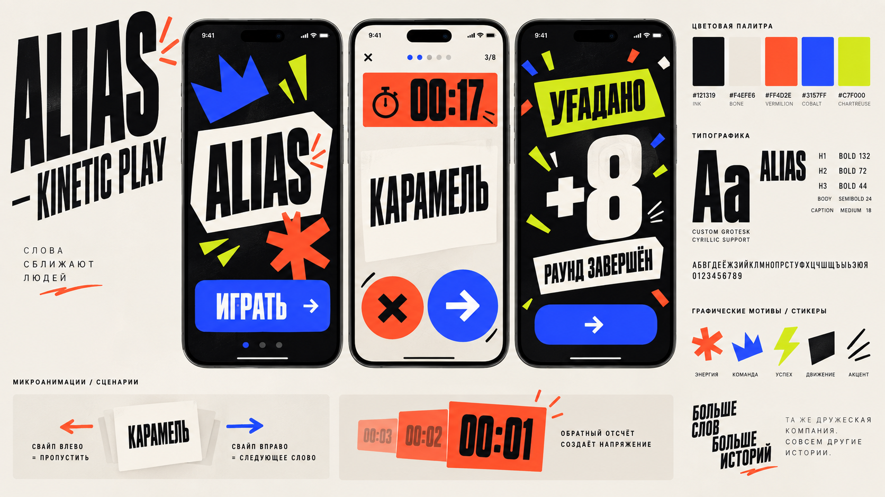

# Alias Design Handoff

Этот документ предназначен для продолжения работы над дизайном Alias в новом чате без повторного брифинга и потери принятых решений.

## Роль следующего ассистента

Работать как арт-директор продукта, а не как пассивный генератор вариантов.

Ожидаемое поведение:

- самостоятельно формировать сильные дизайн-гипотезы;
- давать конкретные решения и аргументировать их;
- не перекладывать арт-директорскую работу на владельца продукта;
- не задавать длинные анкеты и десятки общих вопросов;
- задавать только вопросы, без ответа на которые решение действительно изменится;
- критиковать слабые решения и предлагать более сильную альтернативу;
- учитывать реализуемость на iOS и в SwiftUI;
- сохранять визуальную консистентность между экранами;
- переходить к визуализации, когда она информативнее текстового обсуждения.

Владелец продукта — iOS-разработчик и отвечает за техническую реализацию. Он ожидает, что арт-директор возьмёт на себя визуальное и креативное руководство.

## Продукт

Alias — локальная командная party game для iPhone. Игроки объясняют слова своей команде в течение ограниченного времени, отмечают угаданные и пропущенные слова, передают устройство следующей команде и соревнуются до достижения целевого счёта.

Основные продуктовые особенности:

- 2–5 команд;
- один передаваемый между игроками iPhone;
- настройка времени, целевого счёта и дополнительных правил;
- категории слов;
- дополнительные задания на раунд;
- активный раунд со словом, таймером и свайпами;
- результаты раунда и всей игры;
- сохранение и продолжение незавершённой игры.

Источником продуктовых и дизайн-решений являются указания владельца продукта и документы в `DesignDocs/`. OpenSpec в проектной работе не используется и не должен учитываться.

## Ключевая установка

Существующий визуальный дизайн приложения **нельзя использовать как референс или ограничение**.

Также нельзя принимать существующее количество экранов, их формат, порядок или навигационную структуру за целевую архитектуру продукта.

Проектирование ведётся с чистого листа. Текущую реализацию можно читать только для понимания функций, состояний, навигации и технических ограничений.

Не переносить автоматически из существующего интерфейса:

- палитру;
- типографику;
- градиенты;
- формы карточек;
- компоненты;
- визуальную иерархию;
- характер анимаций;
- текущий Party Pop design system.
- существующее разделение функций по экранам;
- текущую длину и порядок setup flow;
- текущий формат игрового контейнера и результатов.

Арт-директор уполномочен перепроектировать пользовательский сценарий и определить новое количество экранов. Обязательные функции определяются текущими продуктовыми решениями в `DesignDocs` и прямыми указаниями владельца. Новое поведение фиксируется непосредственно в дизайн-документации.

## Принятое направление

Выбрано направление **Kinetic Play — игровое шоу**.

Оно рассматривает iPhone как ведущего живой вечеринки. Визуальный характер:

- энергичный;
- умный;
- дерзкий;
- взрослый;
- соревновательный;
- типографический;
- физичный в жестах и переходах.

Основные признаки направления:

- крупная акцидентная типографика;
- высокий контраст;
- сильные цветовые поля;
- контролируемая асимметрия;
- одно доминирующее действие на экране;
- слово и таймер как главные объекты игрового раунда;
- короткие ударные реакции на действия;
- заметная драматургия между подготовкой, активной игрой и результатом.

Подробное описание находится в [00-creative-direction.md](00-creative-direction.md).

### Выбранная внутренняя вариация

Внутри Kinetic Play владелец продукта выбрал **Card Impact** как наиболее характерную, физичную и эмоциональную вариацию.

Broadcast Grid используется только как дисциплина сетки и иерархии. Это не гибрид с другим арт-направлением.

## Что было отвергнуто

Исследовались шесть направлений:

1. Kinetic Play.
2. Table Talk.
3. Signal Mode.
4. Play Objects.
5. Voice Current.
6. Type Riot.

Владельцу продукта особенно понравились Kinetic Play и Table Talk. После обсуждения он однозначно выбрал **Kinetic Play**.

Предложение объединить Table Talk и Kinetic Play было отвергнуто. Не возвращаться к гибриду без прямого запроса владельца продукта.

Остальные направления остаются историей исследования, а не активными кандидатами.

## Визуальные материалы

### Выбранное направление



### Исследованные альтернативы

- [Table Talk](VisualReferences/02-table-talk.png)
- [Signal Mode](VisualReferences/03-signal-mode.png)
- [Play Objects](VisualReferences/04-play-objects.png)
- [Voice Current](VisualReferences/05-voice-current.png)
- [Type Riot](VisualReferences/06-type-riot.png)

Moodboard являются инструментом направления, а не готовыми UI-макетами. Текстовые артефакты, случайные детали и отдельные компоненты на сгенерированных изображениях не считаются утверждёнными решениями.

## Утверждённая визуальная основа

Приняты базовые palette tokens:

- near-black ink `#121319`;
- elevated ink `#20222B`;
- warm bone `#F4EFE6`;
- muted bone `#E7E0D6`;
- electric vermilion `#FF4D2E`;
- saturated cobalt `#3157FF`;
- signal chartreuse `#C7F000`;
- warning amber `#FFB11B`.

Распределение semantic roles:

- cobalt — primary action и навигация;
- chartreuse — success;
- vermilion — skip, danger и urgency;
- bone — карточки и контрастный текст;
- ink — основная сцена.

Контрастные пары, ограничения и единственное expressive-исключение Game Pulse зафиксированы в `Foundations/colors.md`.

### Решение по пошаговой навигации

Пользователь выбрал характер кнопок из Card Impact B для действий `Назад / Вперёд`. Принята парная круглая конструкция:

- `Forward` — крупный кобальтовый круг с белой стрелкой;
- `Back` — меньший bone-круг с чёрной стрелкой и обводкой;
- красный и xmark не используются для возврата, поскольку зарезервированы для skip/danger;
- пара применяется в линейных сценариях и должна быть проверена на первом собранном vertical slice.

Полная спецификация находится в `Foundations/card-impact-language.md`.

Типографическая гипотеза:

- тяжёлый узкий кириллический гротеск для игровых слов, таймера, счёта и кульминаций;
- нейтральный хорошо читаемый гротеск для навигации, настроек и инструкций;
- декоративная деформация текста допустима только в переходах и не должна ухудшать чтение слова.

## Защитные ограничения направления

Kinetic Play не должен превратиться в:

- неоновый cyberpunk;
- казино;
- generic esports HUD;
- детскую мультяшную игру;
- набор стеклянных карточек;
- бесконечный градиентный фон;
- визуально шумный коллаж;
- интерфейс, в котором декор конкурирует со словом и таймером.

На обычном экране должен доминировать один яркий акцент. Конфетти и максимальная визуальная интенсивность резервируются для редких кульминаций.

## Текущий статус

Завершено:

- исследованы шесть разных направлений;
- выбрано Kinetic Play;
- принято решение не создавать гибрид с Table Talk;
- подготовлен поэтапный план дизайна;
- создана структура `DesignDocs/`;
- сохранены визуальные исследования;
- подготовлены три внутренние вариации Kinetic Play;
- проведена первичная проверка контраста рабочей палитры;
- сформирована предварительная рекомендация по визуальной основе;
- Card Impact подтверждён как визуальная основа;
- разрешено полностью перепроектировать количество, формат и порядок экранов;
- подготовлен и сохранён Card Impact Foundations v1;
- зафиксированы semantic colors, typography, layout, shape и SwiftUI token map;
- собран capability map обязательных функций продукта;
- принята Experience Architecture v1 из восьми основных экранов;
- setup сокращён до трёх шагов;
- матч собран в единый фазовый контейнер;
- Card Impact Foundations проверены на полном вертикальном срезе;
- сохранён визуальный storyboard `VisualReferences/11-card-impact-experience-storyboard.png`;
- отдельно отрисован Game Pulse в состояниях top и invalid challenges: `VisualReferences/12-card-impact-game-pulse-v2.png`;
- для цели и времени приняты точные `− / +` controls вместо slider;
- при невалидном выборе заданий `Forward` disabled, `Back` остаётся доступной;
- завершён Live Card v1 с layout, gesture thresholds, timer states, Pause, Resume, expiration и accessibility;
- сохранены `VisualReferences/13-live-card-core-states.png` и `VisualReferences/14-live-card-system-states.png`;
- круглая пара Skip/Correct утверждена как игровое исключение в Card Impact language;
- завершён Motion Language v1 с duration, easing, input-lock, haptic, sound и Reduce Motion matrices;
- сохранены `VisualReferences/15-motion-card-resolution.png` и `VisualReferences/16-motion-resume-countdown.png`;
- motion tokens вынесены в `Foundations/motion.md`.
- завершена Component Library v1 с четырьмя слоями: foundations, primitives, controls и product compositions;
- зафиксированы component variants, state matrix, responsive/accessibility rules и SwiftUI naming;
- сохранены `VisualReferences/17-card-impact-actions-setup.png` и `VisualReferences/18-card-impact-game-feedback.png`;
- отдельно разделены `StepNavigationControl`, `RoundOutcomeControls` и `UtilityIconButton`;
- публичные components принимают semantic roles вместо произвольных styling flags.
- завершён Complete Product Flow v1 для entry/setup, match/results и system edge cases;
- сохранены `VisualReferences/19-card-impact-setup-flow-v2.png`, `VisualReferences/20-card-impact-match-flow.png` и `VisualReferences/21-card-impact-system-flows-v2.png`;
- Stage Door определён для no-save, valid-save и invalid-save states;
- Line-up закреплён как генератор 2–5 команд без ручного редактирования имён;
- Word Deck использует selection + explicit Forward confirmation;
- Round Call, Round Hit и Victory Slam получили полный layout/state/interaction contract;
- continue routing восстанавливает точную фазу, а active/paused save всегда открывается на Pause;
- native sheet/dialog используются для Rules и destructive save replacement;
- leaving an unfinished game saves before route dismissal and does not require destructive confirmation.
- завершён SwiftUI Handoff v1: определены target modules, lifecycle ownership, display models, component APIs, resource strategy, preview/test matrix и safe implementation order;
- setup передаётся как единый `SetupFlow` с общим draft, а match сохраняется как один phase container;
- внедрение разбито на slices 0–9 без одновременного переписывания всего приложения.

Не завершено:

- реализация Card Impact по vertical slices;
- дизайн-контроль реализации — этап 8.

## Точная точка продолжения

Этапы 1–7 завершены: **Card Impact Foundations v1**, **Experience Architecture v1**, **Live Card v1**, **Motion Language v1**, **Component Library v1**, **Complete Product Flow v1** и **SwiftUI Handoff v1**.

Три внутренние вариации уже подготовлены и описаны в [01-visual-foundation.md](01-visual-foundation.md):

1. Broadcast Grid.
2. Card Impact.
3. Spotlight.

Card Impact утверждён как визуальная основа. Broadcast Grid используется как композиционная дисциплина. Spotlight не рекомендуется как основа всего продукта.

Принята архитектура из восьми основных экранов:

1. Stage Door.
2. Line-up.
3. Game Pulse.
4. Word Deck.
5. Round Call.
6. Live Card.
7. Round Hit.
8. Victory Slam.

Полное решение по flow находится в [09-experience-architecture.md](09-experience-architecture.md). Активный раунд находится в [10-live-card-spec.md](10-live-card-spec.md). Motion находится в [11-motion-spec.md](11-motion-spec.md). Компонентная библиотека находится в [12-component-library.md](12-component-library.md). Детальные оставшиеся экраны находятся в [13-entry-and-setup-spec.md](13-entry-and-setup-spec.md), [14-match-and-results-spec.md](14-match-and-results-spec.md) и [15-system-flows-and-edge-cases.md](15-system-flows-and-edge-cases.md).

Следующее необходимое действие — начать реализацию с `Slice 0 — Card Impact foundations` из [07-swiftui-handoff.md](07-swiftui-handoff.md), затем двигаться по slices 1–9. После каждого собранного slice проводить соответствующую часть этапа 8, не откладывая visual QA до полного переписывания продукта.

Важно: единый обратимый `SetupFlow` с сохранением draft и explicit category confirmation вместо мгновенного старта по тапу уже являются принятыми решениями и должны быть реализованы напрямую.

Следующий ассистент не должен заново спрашивать, какое направление нравится владельцу продукта, или предлагать повторный общий discovery.

## Документы процесса

Работу продолжать в порядке, указанном в [README.md](README.md):

1. [Визуальная основа](01-visual-foundation.md)
2. [Ключевые экраны](02-key-screen-validation.md)
3. [Активный раунд](03-active-round.md)
4. [Motion](04-motion-language.md)
5. [Дизайн-система](05-design-system.md)
6. [Полный сценарий](06-complete-product-flow.md)
7. [SwiftUI handoff](07-swiftui-handoff.md)
8. [Design QA](08-design-qa.md)

## Краткий стартовый промпт для нового чата

```text
Продолжи работу над Alias. Сначала полностью прочитай DesignDocs/HANDOFF.md и DesignDocs/07-swiftui-handoff.md, затем связанные спецификации 12–15. Не используй существующий UI как визуальный референс. Этапы 1–7 уже утверждены. Не проводи discovery заново. Начни реализацию с Slice 0 из SwiftUI Handoff v1, проверяй каждый slice по DesignDocs/08-design-qa.md и не смешивай Party Pop с Card Impact внутри одного экрана.
```
